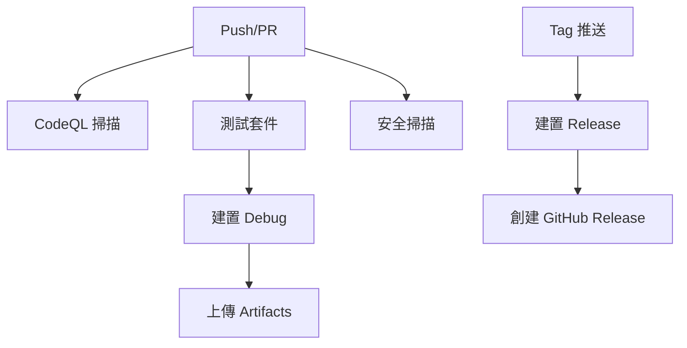

# CI/CD 工作流程說明

本目錄包含 Wealth Manager 專案的 GitHub Actions 工作流程配置。

## 📁 檔案結構

### 主要工作流程

- **`android-ci.yml`** - 主要的 Android 建置和發布工作流程
- **`security-scan.yml`** - 安全掃描工作流程
- **`test.yml`** - 測試套件工作流程

## 🔧 主要改進 (基於 GitHub 2025年10月指南)

### ✅ 已修復的問題

1. **YAML 語法錯誤**
   - 移除了重複的步驟定義
   - 修復了語法結構問題

2. **Actions 版本升級**
   - `actions/checkout@v4` → `@v5`
   - `actions/upload-artifact@v4` → `@v5`
   - `softprops/action-gh-release@v2` → `@v2.1.0`
   - `gradle/actions/setup-gradle@v3` → `@v4`

3. **安全權限改善**
   - 使用最小權限原則
   - 添加了 `security-events: write` 權限
   - 移除了過於寬鬆的 `contents: write` 權限

### 🛡️ 新增安全功能

1. **CodeQL 安全掃描**
   - 自動化靜態程式碼分析
   - 支援 Java/Kotlin 語言
   - 整合到主要工作流程中

2. **依賴項漏洞檢查**
   - 使用 OWASP Dependency Check
   - 定期掃描第三方依賴項
   - 生成詳細的安全報告

3. **秘密掃描**
   - 使用 TruffleHog 掃描敏感資訊洩露
   - 檢查 Git 歷史記錄
   - 防止憑證洩露

### ⚡ 效能優化

1. **改善快取策略**
   - 升級 Gradle 快取設定
   - 啟用 `gradle-home-cache-cleanup`
   - 優化建置時間

2. **並行測試**
   - 使用矩陣策略測試多個 Android API 版本
   - 支援不同的目標平台
   - 減少整體測試時間

### 📊 測試覆蓋率

1. **重新啟用程式碼品質檢查**
   - 啟用 Detekt 靜態分析
   - 強制執行程式碼標準
   - 防止品質下降

2. **單元測試**
   - 自動執行單元測試
   - 支援 Debug 和 Release 版本
   - 測試失敗時阻止建置

3. **整合測試**
   - 使用 Android 模擬器
   - 支援多個 API 版本測試
   - 自動化 UI 測試

## 🚀 使用方式

### 觸發條件

- **Push 到分支**: 自動觸發建置和測試
- **Pull Request**: 觸發完整的 CI 檢查
- **標籤推送**: 觸發發布流程
- **定時執行**: 每日安全掃描

### 工作流程依賴

## 📋 最佳實踐

1. **定期更新 Actions 版本**
2. **監控安全掃描結果**
3. **保持測試覆蓋率**
4. **遵循最小權限原則**
5. **使用語義化版本標籤**

## 🔍 故障排除

### 常見問題

1. **建置失敗**: 檢查 Gradle 配置和依賴項
2. **測試失敗**: 查看測試報告和日誌
3. **安全掃描警告**: 及時修復安全漏洞
4. **權限錯誤**: 檢查 GitHub 權限設定

### 日誌位置

- 建置日誌: Actions 頁面
- 測試報告: Artifacts 下載
- 安全報告: Security 標籤頁

## 📞 支援

如有問題，請：
1. 檢查 GitHub Actions 日誌
2. 查看相關文件
3. 提交 Issue 或 Pull Request
