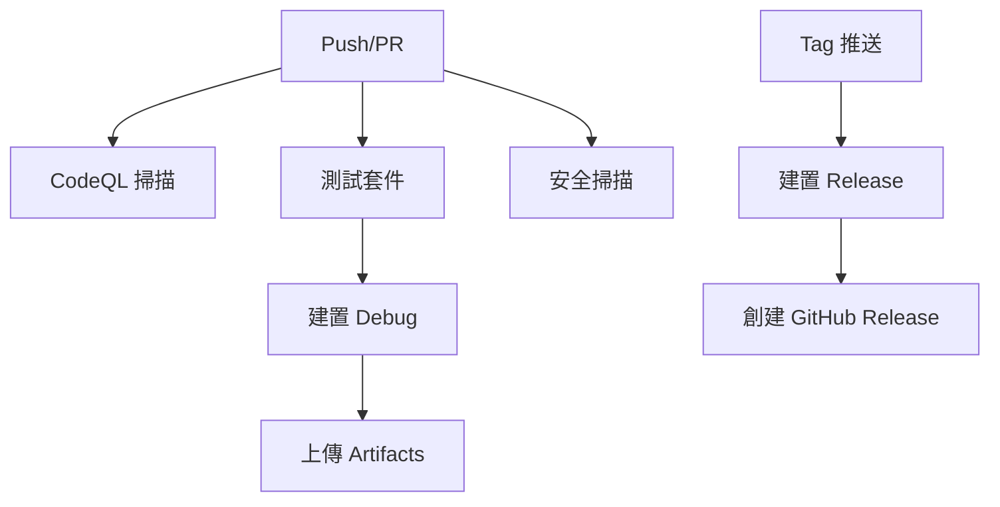

# CI/CD 工作流程說明

本目錄包含 Wealth Manager 專案的 GitHub Actions 工作流程配置。

## 📁 檔案結構

### 主要工作流程

- **`release.yml`** - 發布工作流程（標籤觸發）

## 🔧 發布工作流程功能

### ✅ 主要功能

1. **自動化發布**
   - 標籤觸發（v*.*.*格式）
   - 自動構建AAB和APK文件
   - 自動創建GitHub Release

2. **環境配置**
   - JDK 17 (Temurin)
   - Android SDK 35 (Android 15)
   - Gradle 8.13
   - Build Tools 35.0.0

3. **安全簽名**
   - 使用GitHub Secrets管理簽名密鑰
   - 支援Release和Debug簽名配置
   - 自動解碼keystore文件

4. **版本管理**
   - 從Git標籤自動計算版本號
   - 使用GitHub Run Number作為版本代碼
   - 支援語義化版本標籤

5. **文件完整性**
   - 自動生成SHA256校驗碼
   - 包含mapping.txt混淆映射
   - 提供完整的發布包

## 🚀 使用方式

### 觸發條件

- **Push 到分支**: 自動觸發建置和測試
- **Pull Request**: 觸發完整的 CI 檢查
- **標籤推送**: 觸發發布流程
- **定時執行**: 每日安全掃描

### 工作流程依賴

## 📋 最佳實踐

1. **定期更新 Actions 版本**
2. **監控安全掃描結果**
3. **保持測試覆蓋率**
4. **遵循最小權限原則**
5. **使用語義化版本標籤**

## 🔍 故障排除

### 常見問題

1. **建置失敗**: 檢查 Gradle 配置和依賴項
2. **測試失敗**: 查看測試報告和日誌
3. **安全掃描警告**: 及時修復安全漏洞
4. **權限錯誤**: 檢查 GitHub 權限設定

### 日誌位置

- 建置日誌: Actions 頁面
- 測試報告: Artifacts 下載
- 安全報告: Security 標籤頁

## 📞 支援

如有問題，請：
1. 檢查 GitHub Actions 日誌
2. 查看相關文件
3. 提交 Issue 或 Pull Request
