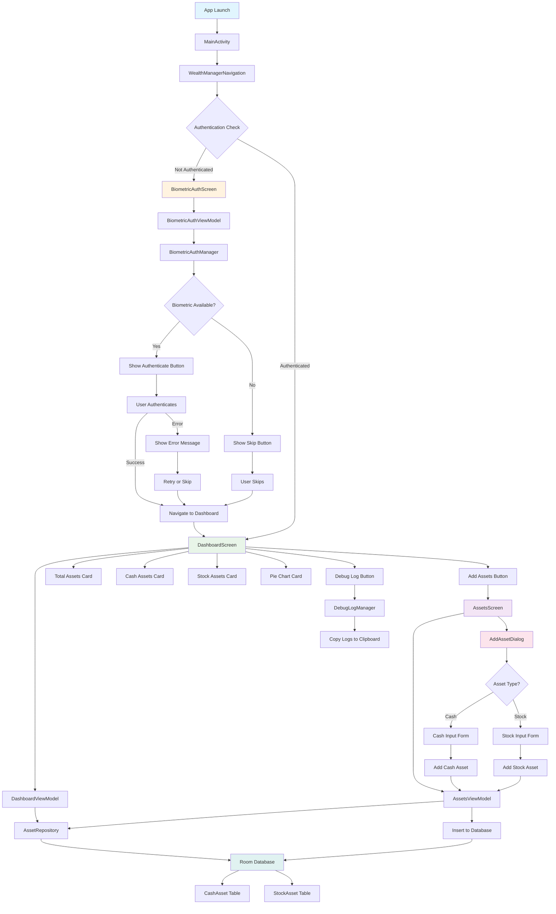
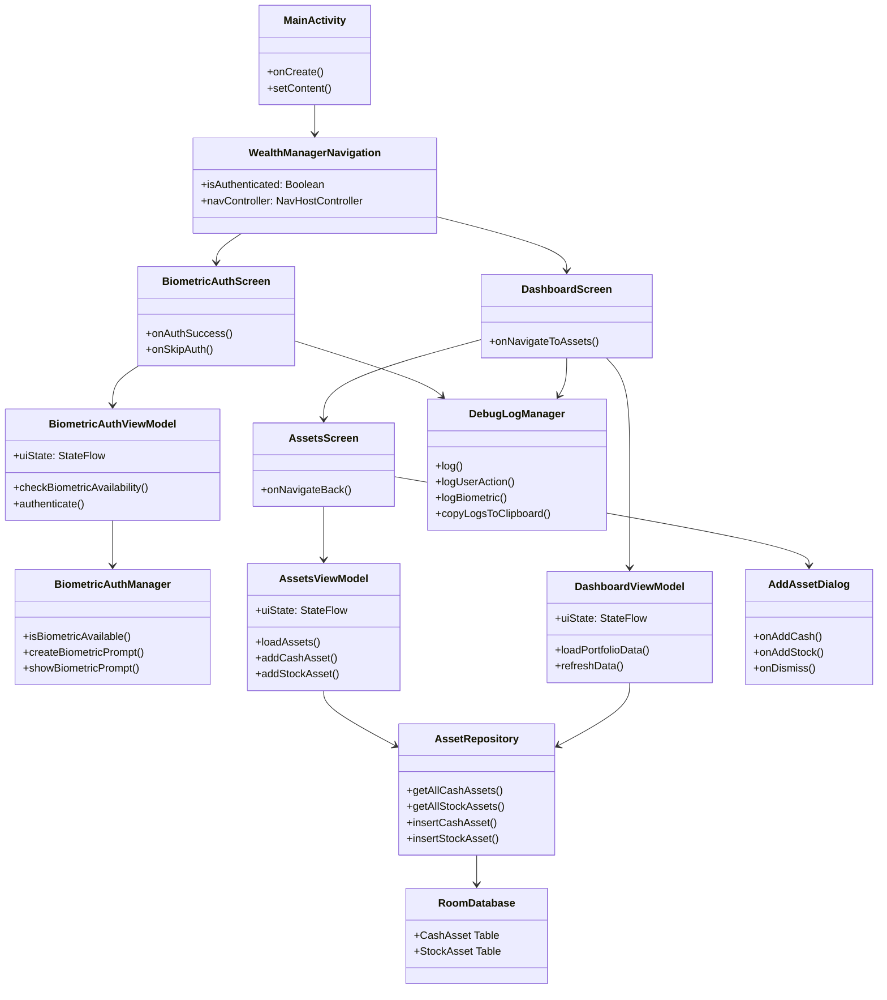
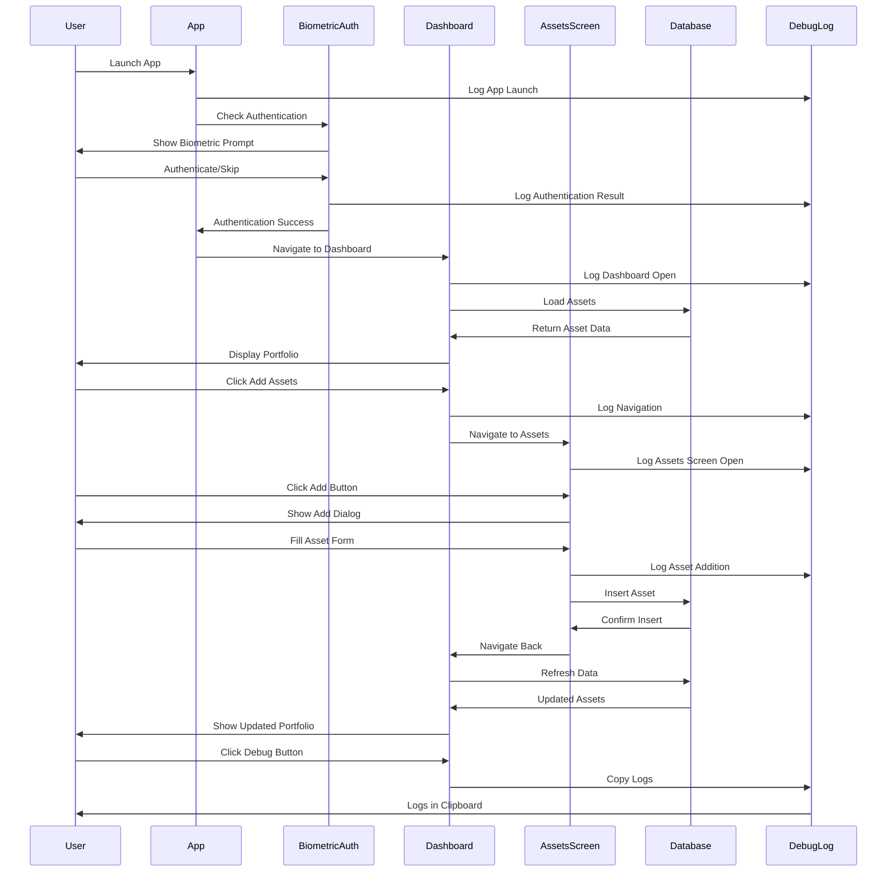

# Personal Asset Tracking App

A secure, privacy-focused personal asset tracking application that provides real-time portfolio visualization with local data storage.

## 🎯 Application Overview

This application is designed to provide a secure and private personal asset tracking tool. All data is stored locally on the device without any cloud synchronization. The core functionality uses real-time market data to calculate the total value of user assets and displays the proportion of each asset (cash and stocks) in a pie chart format, with all values unified in TWD (Taiwan Dollar) equivalent.

## 🔐 Security & Authentication

### Biometric Authentication
- **Mandatory Authentication**: The app requires biometric authentication (fingerprint, face recognition, etc.) upon startup
- **Access Denial**: If biometric authentication fails or the device doesn't have biometric features enabled, the app will deny access and suggest users enable system biometric features
- **No Password Login**: The app doesn't require account registration, passwords, or any form of cloud login

## 🎨 UI/UX & Localization

### Dynamic Theming (Material You)
- **Material You Design**: All interface elements follow Android's Material You design guidelines
- **Auto Color Adaptation**: All major UI elements (buttons, titles, background blocks) automatically adjust colors based on the user's current system theme

### Multi-language Support
- **Supported Languages**: Traditional Chinese (zh-TW) and English (en-US)
- **Auto-Localization**: The app automatically detects the user's system language on startup
- **Language Logic**:
  - If system language is Traditional Chinese → App switches to Traditional Chinese
  - If system language is English → App switches to English  
  - If system language is any other language → App defaults to English interface
- **Complete Localization**: All interface text, labels, prompts, and error messages are properly localized

## 💰 Asset Management

### Cash Assets
- **Supported Currencies**: TWD Cash and USD Cash
- **Operations**: Manual input and real-time adjustment of amounts
- **Status**: ✅ Fully implemented with AddAssetDialog and database integration

### Stock Assets
- **Asset Structure**: stockTicker (symbol), sharesCount (shares), market (TW/US)
- **Adding Process**:
  1. User selects market (Taiwan or US stocks)
  2. User inputs stock name or symbol
  3. App performs fuzzy search via Google Finance API
  4. Dropdown menu displays matching stock symbols and company names
  5. Stock symbols are stored in standard format (e.g., US stocks: AAPL, Taiwan stocks: 2330.TW or 2330)
- **Status**: 🚧 Basic UI implemented, API integration and search functionality pending

## 📊 Data Processing & Market Data

### Market Data & APIs
- **Data Source**: Google Finance API (preferred) or other viable financial data services
- **Data Content**: Latest closing prices for all recorded stocks
- **Update Frequency**: Automatic updates on app startup or user-initiated refresh
- **Status**: 🚧 Network dependencies added, API implementation pending

### Currency Conversion & Calculation
- **Exchange Rate**: Current or latest trading day USD/TWD exchange rate
- **Unified Currency**: All assets (USD cash and US stocks) converted to TWD equivalent
- **Total Asset Calculation**: 
  ```
  Total Assets = (TWD Cash) + (USD Cash TWD Equivalent) + (All Stocks TWD Equivalent Total Market Value)
  ```
- **Status**: 🚧 Database structure ready, conversion logic needs implementation

## 📈 Visualization & Data Presentation

### Asset Pie Chart
- **Overview**: Pie chart based on TWD equivalent showing proportion of all asset categories
- **Chart Information**: Each segment clearly displays asset name, TWD equivalent amount, and percentage
- **Status**: 🚧 UI component exists, chart rendering needs implementation

### Detailed List View
- **Cash Details**: Original currency, original amount, TWD equivalent
- **Stock Details**: Stock symbol, shares held, last closing price, original currency total market value, TWD equivalent total market value
- **Status**: ✅ Implemented with Material 3 cards and responsive layout

## 🛠 Technical Implementation

### Architecture & Technologies
- **Architecture**: MVVM (Model-View-ViewModel) with Clean Architecture principles
- **UI Framework**: Jetpack Compose with Material 3 design system
- **Dependency Injection**: Hilt for modern dependency injection
- **Database**: Room database with local storage
- **Annotation Processing**: KSP (Kotlin Symbol Processing) for better performance
- **Navigation**: Navigation Compose for type-safe navigation
- **State Management**: StateFlow and Compose state management

### Platform & API
- **Target Platform**: Android (Material You support, recommended API 31+)
- **Supported Markets**: Taiwan Stock Exchange (TW) and US Stock Exchange (US)
- **Minimum SDK**: API 23 (Android 6.0)
- **Target SDK**: API 34 (Android 14)

### Data Storage
- **Local Storage**: All user asset data and app settings stored using Android local storage (Room Database or file system)
- **No Cloud Sync**: Strictly prohibits any cloud synchronization or data upload to ensure user data remains securely on the device
- **Database Tables**: 
  - `cash_assets`: TWD and USD cash holdings
  - `stock_assets`: Stock investments with market data
  - `exchange_rates`: Currency conversion rates

## 🚀 Features

### ✅ Implemented Features
- **Biometric Authentication**: Secure fingerprint/face recognition with fallback options
- **Material You Design**: Dynamic theming with system color adaptation
- **Multi-language Support**: Traditional Chinese (zh-TW) and English (en-US) with auto-detection
- **Asset Management**: Add/edit cash and stock assets with intuitive UI
- **Local Data Storage**: Room database with no cloud dependency
- **Debug Logging**: Comprehensive logging system for troubleshooting
- **Navigation**: Smooth navigation between authentication, dashboard, and asset management
- **Responsive UI**: Modern Compose UI with Material 3 components
- **KSP Migration**: Modern Kotlin Symbol Processing for better performance
- **Error Handling**: Comprehensive error handling with user-friendly messages
- **Skip Authentication**: Option to bypass biometric authentication when hardware unavailable

### 🚧 Partially Implemented Features
- **Market Data Integration**: Network dependencies added but API implementation pending
- **Exchange Rate Conversion**: Database structure ready but conversion logic needs implementation
- **Stock Price Updates**: Entity structure exists but real-time price fetching not implemented
- **Pie Chart Visualization**: UI component exists but chart rendering needs implementation

### ❌ Pending Features
- **Google Finance API Integration**: Network service layer needs implementation
- **Real-time Market Data**: API calls and data fetching logic
- **Interactive Charts**: Chart library integration and rendering
- **Stock Search**: Fuzzy search functionality for stock symbols
- **Price Alerts**: Notification system for price changes
- **Data Export**: Export portfolio data functionality

## 📱 Getting Started

1. **Installation**: Download and install the app from the Google Play Store
2. **First Launch**: Enable biometric authentication when prompted
3. **Add Assets**: Start by adding your cash holdings and stock investments
4. **View Portfolio**: Monitor your asset allocation through the interactive pie chart
5. **Stay Updated**: The app automatically updates market data and exchange rates

## 🔒 Privacy & Security

This application prioritizes user privacy and data security:
- All data remains on your device
- No account registration required
- No data transmission to external servers
- Biometric authentication ensures only you can access your financial data

## 🏗️ Application Architecture

### Page Flow & Navigation


### Component Architecture


### Data Flow


## 📊 Development Status

### Current Implementation Status
- **Core Features**: 80% Complete
- **UI/UX**: 95% Complete
- **Data Management**: 90% Complete
- **Authentication**: 100% Complete
- **Localization**: 100% Complete
- **Market Data Integration**: 20% Complete
- **Chart Visualization**: 30% Complete

### Recent Updates (v0.1.1)
- ✅ Migrated from KAPT to KSP for better performance
- ✅ Fixed biometric authentication issues
- ✅ Implemented comprehensive asset management
- ✅ Added debug logging system
- ✅ Enhanced error handling and user experience
- ✅ Added skip authentication option
- ✅ Improved navigation flow

### Next Development Priorities
1. **Market Data API Integration**: Implement Google Finance API or alternative data source
2. **Real-time Price Updates**: Add automatic price fetching and updates
3. **Chart Visualization**: Integrate chart library for pie chart rendering
4. **Stock Search**: Implement fuzzy search for stock symbols
5. **Exchange Rate Updates**: Add automatic currency conversion
6. **Performance Optimization**: Optimize database queries and UI rendering

## 📞 Support

For technical support or feature requests, please contact the development team through the app's support section.

---

**Version**: 0.1.1  
**Last Updated**: 2024  
**Platform**: Android 6.0+ (API 23+)