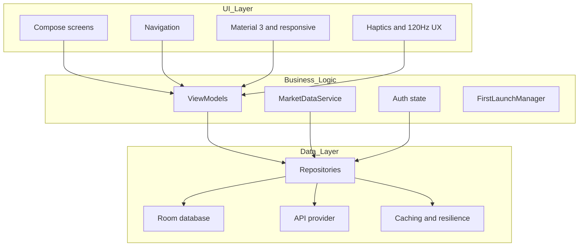
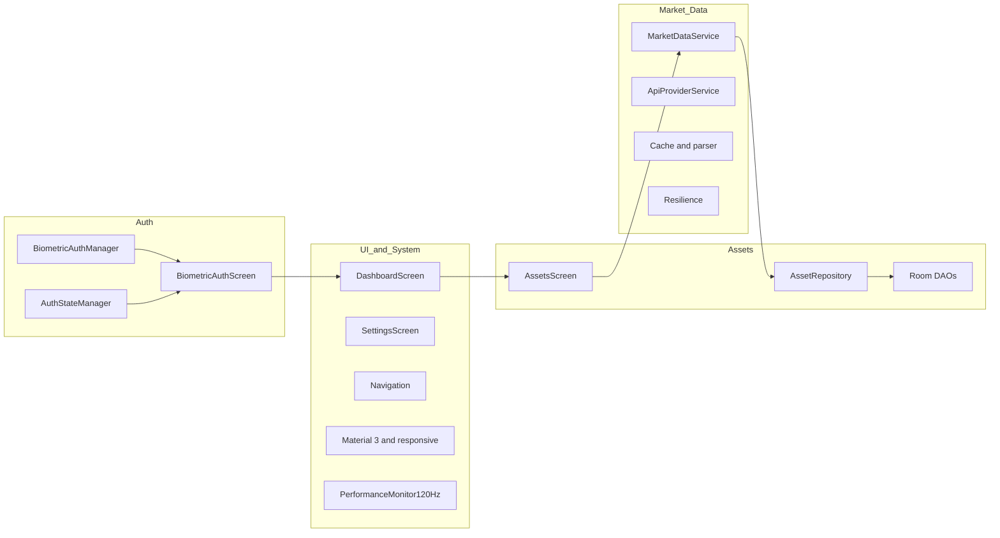
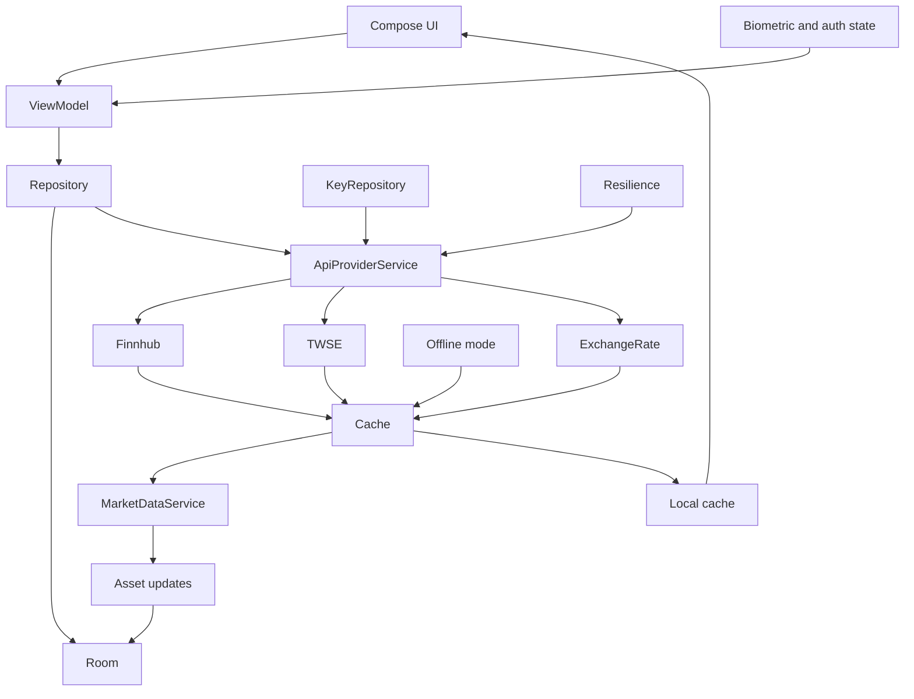
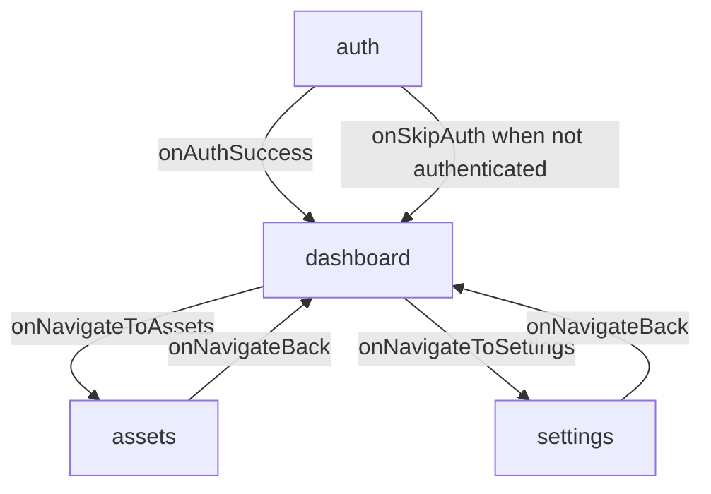

# Wealth Manager

Modern Android personal finance tracker powered by Jetpack Compose. Local-only data storage, biometric authentication, real‑time market data (Finnhub, TWSE, ExchangeRate‑API), multilingual UI, 120Hz optimizations, and rich haptics. **Now fully compliant with Android 2025 official design guidelines!**

Language: [English](README.md) | [繁體中文](README_zh.md)

## Features

- 🔐 **Biometric Security**: Fingerprint/face authentication with 24‑hour session timeout
- 💰 **Portfolio Tracking**: Cash and stock management with full CRUD
- 📊 **Real‑time Market Data**: Finnhub (global), TWSE (Taiwan), ExchangeRate‑API (USD/TWD)
- 🔁 **Resilience Built‑in**: Failover, retry, request deduplication, and offline cache
- 🎨 **Material You**: Dynamic color with responsive layouts
- ⚙️ **Performance**: 120Hz‑friendly UI and performance monitoring
- 🌍 **Localization**: English and Traditional Chinese, instant switching
- ⌚ **Wear OS**: Companion sync via data layer (separate Wear module)
- 🚀 **Android 2025 Compliant**: Latest API 36, Splash Screen, Edge-to-Edge, Notification permissions
- 🔔 **Smart Notifications**: Android 13+ notification permission management

## 📱 Screenshots

<div align="center">

### Portfolio Overview & Asset Management
<table>
<tr>
<td width="50%">

<p align="center"><em>Portfolio overview with distribution and real‑time valuation</em></p>
</td>
<td width="50%">

<p align="center"><em>Manage cash and stocks with an intuitive workflow</em></p>
</td>
</tr>
</table>

### Biometric Authentication & Add Assets
<table>
<tr>
<td width="50%">

<p align="center"><em>Secure sign‑in with clear privacy notice</em></p>
</td>
<td width="50%">

<p align="center"><em>Smart add flow with stock search and symbol lookup</em></p>
</td>
</tr>
</table>

### About & Privacy
<table>
<tr>
<td width="50%">

<p align="center"><em>Transparent privacy and third‑party API disclosure</em></p>
</td>
<td width="50%">
<!-- Empty cell for balanced layout -->
</td>
</tr>
</table>

</div>

## Security & Privacy

- **Local‑only storage**: Financial data stays on the device (no cloud sync)
- **Biometric authentication**: No passwords, 24‑hour session timeout
- **API keys encrypted on‑device**: Stored with EncryptedSharedPreferences
- **Logging hygiene**: Keys redacted; diagnostics focus on non‑sensitive details

Docs: [Security Policy](docs/security/SECURITY.md) · [API Setup](docs/api/API_SETUP.md)

## Getting Started

```bash
# Clone the repository (or your fork)
git clone https://github.com/kuoyaoming/Wealth-Manager.git

# Build (Debug)
./gradlew -PwmVersionName=0.0.0-beta.local -PwmVersionCode=1 assembleDebug

# Install on device
./gradlew installDebug
```

Requirements
- Android 14+ (API 34+)
- Target SDK 35 (Android 15)
- Biometric hardware recommended
- Internet connection for market data

## API Keys

- Configure inside the app: Settings → Manage API Keys → Validate & Save
- Keys are stored encrypted on‑device; do not commit keys to source control
- No BuildConfig keys; avoid placing real keys in `local.properties`
- Detailed steps: [docs/api/API_SETUP.md](docs/api/API_SETUP.md)
 - Detailed steps: [API Setup (English)](docs/api/API_SETUP.md) · [繁體中文](docs/api/API_SETUP_zh.md)

## Architecture Overview

- **Pattern**: MVVM + Repository
- **Data**: Room (local storage), Retrofit/OkHttp
- **DI**: Hilt
- **UI**: Jetpack Compose + Material 3
- **Security**: EncryptedSharedPreferences for API keys; biometric auth



### Core Modules



## Data Flow



## Tech Stack

- Kotlin, Jetpack Compose, Material 3
- Hilt, Room (local storage), Retrofit, OkHttp (logging)
- AndroidX Biometric
- Coroutines/Flows
- Wear OS data layer

## Wear OS

- Separate module `wear` (`minSdk 30`, `targetSdk 35`)
- Companion sync via `MobileWearSyncService` using Play Services Wearable

## Contributing

See [docs/development/CONTRIBUTING.md](docs/development/CONTRIBUTING.md)

## License

MIT License — see [LICENSE](LICENSE)

---

Version: 1.4.7  
Last Updated: 2025  
Min SDK: 34 (Android 14)  
Target SDK: 35 (Android 15)

## Release & Versioning

- versionName: Derived from Git tag `vX.Y.Z` → `X.Y.Z` (SemVer)
- versionCode: Assigned by CI with `GITHUB_RUN_NUMBER`
- Release AAB: Produced only on CI when a tag is pushed

Examples
```bash
# Create and push release tag
git tag v1.4.7
git push origin v1.4.7

# Local debug build (release bundles are CI‑only)
./gradlew -PwmVersionName=0.0.0-beta.local -PwmVersionCode=1 assembleDebug
```

### Navigation Graph



Artifacts
- On tag, CI builds `:app:bundleRelease` and uploads `.aab` and `mapping.txt`

## Development Status

### ✅ Completed
- Biometric auth with 24‑hour session timeout
- Cash/stock asset management (CRUD)
- Real‑time market data (Finnhub, TWSE, ExchangeRate‑API)
- Failover, retry, request deduplication
- Responsive UI with Material 3
- English/Traditional Chinese localization
- Performance monitoring and 120Hz optimizations
- Smart caching with offline support
- Error recovery & diagnostics

### 🚧 In Development
- Portfolio charts
- Advanced analytics
- Data export
- Enhanced chart components