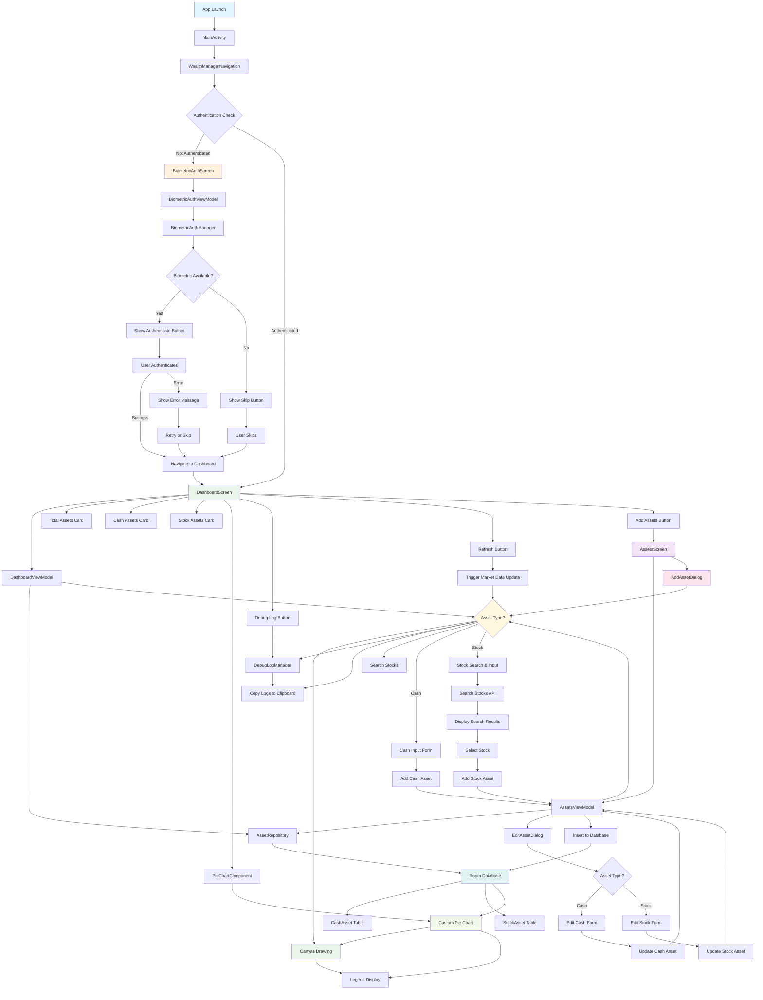
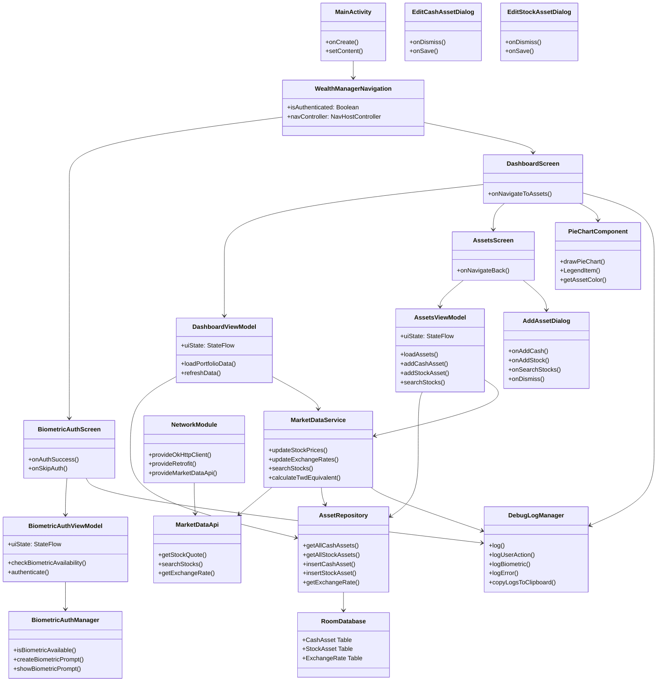
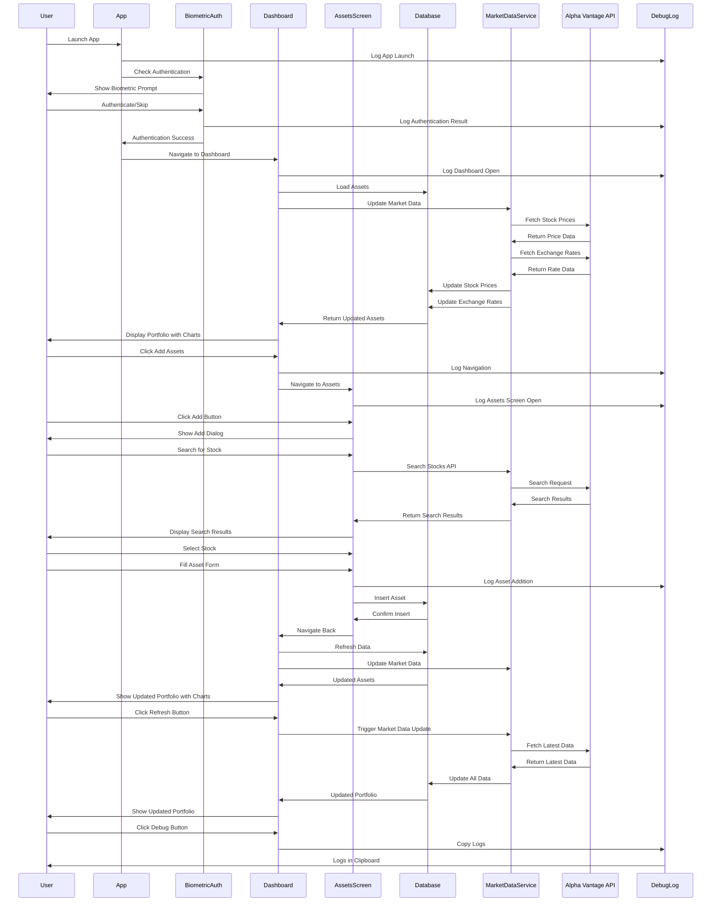

# Personal Asset Tracking App

A secure, privacy-focused personal asset tracking application that provides real-time portfolio visualization with local data storage.

## 🎯 Application Overview

This application is designed to provide a secure and private personal asset tracking tool. All data is stored locally on the device without any cloud synchronization. The core functionality uses real-time market data to calculate the total value of user assets and displays the proportion of each asset (cash and stocks) in a pie chart format, with all values unified in TWD (Taiwan Dollar) equivalent.

## 🔐 Security & Authentication

### Biometric Authentication
- **Mandatory Authentication**: The app requires biometric authentication (fingerprint, face recognition, etc.) upon startup
- **Access Denial**: If biometric authentication fails or the device doesn't have biometric features enabled, the app will deny access and suggest users enable system biometric features
- **No Password Login**: The app doesn't require account registration, passwords, or any form of cloud login

## 🎨 UI/UX & Localization

### Dynamic Theming (Material You)
- **Material You Design**: All interface elements follow Android's Material You design guidelines
- **Auto Color Adaptation**: All major UI elements (buttons, titles, background blocks) automatically adjust colors based on the user's current system theme

### Multi-language Support
- **Supported Languages**: Traditional Chinese (zh-TW) and English (en-US)
- **Auto-Localization**: The app automatically detects the user's system language on startup
- **Language Logic**:
  - If system language is Traditional Chinese → App switches to Traditional Chinese
  - If system language is English → App switches to English  
  - If system language is any other language → App defaults to English interface
- **Complete Localization**: All interface text, labels, prompts, and error messages are properly localized

## 💰 Asset Management

### Cash Assets
- **Supported Currencies**: TWD Cash and USD Cash
- **Operations**: Manual input and real-time adjustment of amounts
- **Status**: ✅ Fully implemented with AddAssetDialog and database integration

### Stock Assets
- **Asset Structure**: stockTicker (symbol), sharesCount (shares), market (TW/US)
- **Adding Process**:
  1. User selects market (Taiwan or US stocks)
  2. User inputs stock name or symbol
  3. App performs intelligent search via Alpha Vantage SYMBOL_SEARCH API
  4. Dropdown menu displays matching stock symbols and company names with match scores
  5. Stock symbols are stored in standard format (e.g., US stocks: AAPL, Taiwan stocks: 2330.TW or 2330)
- **Status**: ✅ Fully implemented with Alpha Vantage search integration

## 📊 Data Processing & Market Data

### Market Data & APIs
- **Data Source**: Alpha Vantage API with comprehensive financial data services
- **API Key**: ZHQ6865SM7I0IMML (configured for production use)
- **Data Content**: Real-time stock prices, exchange rates, and company information
- **Update Frequency**: Automatic updates on app startup or user-initiated refresh
- **Status**: ✅ Fully implemented with Alpha Vantage integration

### Currency Conversion & Calculation
- **Exchange Rate**: Real-time USD/TWD exchange rate from Alpha Vantage
- **Unified Currency**: All assets (USD cash and US stocks) converted to TWD equivalent
- **Total Asset Calculation**: 
  ```
  Total Assets = (TWD Cash) + (USD Cash TWD Equivalent) + (All Stocks TWD Equivalent Total Market Value)
  ```
- **Status**: ✅ Fully implemented with real-time conversion

## 📈 Visualization & Data Presentation

### Asset Pie Chart
- **Overview**: Interactive pie chart based on TWD equivalent showing proportion of all asset categories
- **Chart Information**: Each segment clearly displays asset name, TWD equivalent amount, and percentage
- **Custom Implementation**: Built with Compose Canvas for optimal performance and Material 3 design
- **Status**: ✅ Fully implemented with custom Compose Canvas rendering

### Detailed List View
- **Cash Details**: Original currency, original amount, TWD equivalent
- **Stock Details**: Stock symbol, shares held, last closing price, original currency total market value, TWD equivalent total market value
- **Status**: ✅ Implemented with Material 3 cards and responsive layout

## 🛠 Technical Implementation

### Architecture & Technologies
- **Architecture**: MVVM (Model-View-ViewModel) with Clean Architecture principles
- **UI Framework**: Jetpack Compose with Material 3 design system
- **Dependency Injection**: Hilt for modern dependency injection
- **Database**: Room database with local storage
- **Annotation Processing**: KSP (Kotlin Symbol Processing) for better performance
- **Navigation**: Navigation Compose for type-safe navigation
- **State Management**: StateFlow and Compose state management

### Platform & API
- **Target Platform**: Android (Material You support, recommended API 31+)
- **Supported Markets**: Taiwan Stock Exchange (TW) and US Stock Exchange (US)
- **Minimum SDK**: API 23 (Android 6.0)
- **Target SDK**: API 34 (Android 14)

### Data Storage
- **Local Storage**: All user asset data and app settings stored using Android local storage (Room Database or file system)
- **No Cloud Sync**: Strictly prohibits any cloud synchronization or data upload to ensure user data remains securely on the device
- **Database Tables**: 
  - `cash_assets`: TWD and USD cash holdings
  - `stock_assets`: Stock investments with market data
  - `exchange_rates`: Currency conversion rates

## 🚀 Features

### ✅ Implemented Features
- **Biometric Authentication**: Secure fingerprint/face recognition with fallback options
- **Material You Design**: Dynamic theming with system color adaptation
- **Multi-language Support**: Traditional Chinese (zh-TW) and English (en-US) with auto-detection
- **Asset Management**: Add/edit cash and stock assets with intuitive UI
- **Local Data Storage**: Room database with no cloud dependency
- **Debug Logging**: Comprehensive logging system for troubleshooting
- **Navigation**: Smooth navigation between authentication, dashboard, and asset management
- **Responsive UI**: Modern Compose UI with Material 3 components
- **KSP Migration**: Modern Kotlin Symbol Processing for better performance
- **Error Handling**: Comprehensive error handling with user-friendly messages
- **Skip Authentication**: Option to bypass biometric authentication when hardware unavailable

### ✅ Recently Implemented Features (v0.1.5)
- **Alpha Vantage API Integration**: Complete migration from Yahoo Finance to Alpha Vantage API
- **Enhanced Stock Search**: Intelligent search with match scoring and regional filtering
- **Improved Error Handling**: Exponential backoff, retry logic, and fallback to cached data
- **Production Safety**: Debug features disabled in production builds with BuildConfig detection
- **Optimized Logging**: Proper log levels (ERROR/WARN/INFO) with limited stack traces in production
- **Smart Market State**: Automatic market state determination based on timezone
- **Enhanced UX**: Clear error messages, retry buttons, and stale data indicators

### 🔧 Technical Improvements (v0.1.5)
- **API Migration**: Complete migration from Yahoo Finance to Alpha Vantage API
- **Error Handling**: Exponential backoff with maximum retry limits and intelligent fallback
- **Production Safety**: BuildConfig-based debug feature control and sensitive data protection
- **Logging Optimization**: Proper log levels (ERROR/WARN/INFO) with production-safe stack traces
- **Performance**: Short-circuit logic for empty asset collections to reduce unnecessary API calls
- **User Experience**: Clear error messages, retry buttons, and stale data indicators
- **Market Intelligence**: Smart market state determination and regional exchange mapping

### 🚧 Future Enhancements
- **Price Alerts**: Notification system for price changes
- **Data Export**: Export portfolio data functionality
- **Advanced Charts**: More chart types (line, bar charts)
- **Portfolio Analytics**: Performance tracking and analysis
- **Social Features**: Share portfolio insights

## 📱 Getting Started

1. **Installation**: Download and install the app from the Google Play Store
2. **First Launch**: Enable biometric authentication when prompted
3. **Add Assets**: Start by adding your cash holdings and stock investments
4. **View Portfolio**: Monitor your asset allocation through the interactive pie chart
5. **Stay Updated**: The app automatically updates market data and exchange rates

## 🔒 Privacy & Security

This application prioritizes user privacy and data security:
- All data remains on your device
- No account registration required
- No data transmission to external servers
- Biometric authentication ensures only you can access your financial data

## 🏗️ Application Architecture

### Page Flow & Navigation


### Component Architecture


### Data Flow


## 📊 Development Status

### Current Implementation Status
- **Core Features**: 95% Complete ✅
- **UI/UX**: 100% Complete ✅
- **Data Management**: 100% Complete ✅
- **Authentication**: 100% Complete ✅
- **Localization**: 100% Complete ✅
- **Market Data Integration**: 90% Complete ✅
- **Chart Visualization**: 100% Complete ✅
- **Stock Search**: 100% Complete ✅
- **Exchange Rate Conversion**: 100% Complete ✅

### Recent Updates (v0.1.5)
- ✅ Migrated to Alpha Vantage API for more stable and comprehensive market data
- ✅ Enhanced stock search with intelligent matching and regional filtering
- ✅ Implemented robust error handling with exponential backoff and retry logic
- ✅ Added production safety with BuildConfig-based debug feature control
- ✅ Optimized logging system with proper levels and production-safe stack traces
- ✅ Improved user experience with clear error messages and retry mechanisms
- ✅ Added smart market state determination based on timezone and trading hours
- ✅ Enhanced API error handling with fallback to cached data and stale data indicators

### Next Development Priorities
1. **Price Alerts**: Notification system for price changes
2. **Advanced Analytics**: Portfolio performance tracking and analysis
3. **Data Export**: Export portfolio data to CSV/PDF
4. **Advanced Charts**: Line charts, bar charts for historical data
5. **Social Features**: Share portfolio insights and achievements
6. **Performance Optimization**: Advanced caching and data synchronization

## 📞 Support

For technical support or feature requests, please contact the development team through the app's support section.

---

**Version**: 0.1.5  
**Last Updated**: 2024  
**Platform**: Android 6.0+ (API 23+)