# Wealth Manager

[](LICENSE)
[](https://developer.android.com/about/versions/14)
[](https://kotlinlang.org/)
[](https://developer.android.com/jetpack/compose)

A modern Android personal finance tracker built with Jetpack Compose, featuring biometric security, real-time market data, and Wear OS integration. All data is stored locally with no cloud sync for complete privacy.

## ✨ Features

### 🔐 **Security & Privacy**
- **Biometric Authentication**: Fingerprint/face recognition with 24-hour session timeout
- **Local-Only Storage**: All financial data encrypted and stored on device
- **No Cloud Sync**: Complete privacy with no data collection or analytics
- **API Key Encryption**: Secure storage using Android Keystore

### 💰 **Asset Management**
- **Cash Tracking**: Support for TWD and USD currencies
- **Stock Portfolio**: Complete CRUD operations for stock holdings
- **Real-Time Data**: Live market prices from multiple APIs
- **Smart Search**: Real-time stock symbol lookup with debouncing

### 📊 **Market Data Integration**
- **Finnhub API**: Global stock market data
- **TWSE API**: Taiwan stock exchange integration
- **Exchange Rate API**: Real-time USD/TWD conversion
- **Smart Failover**: Automatic API switching with retry mechanisms
- **Offline Support**: Intelligent caching with offline availability

# Wealth Manager

A modern, privacy-focused personal finance tracker for Android and Wear OS. Wealth Manager is built with Jetpack Compose, Kotlin, and the latest Android technologies, providing secure local data storage, biometric authentication, and real-time market data integration.

---

## 🚀 Key Features

- **Local-Only Data Storage**: All financial data is encrypted and stored on your device. No cloud sync, no analytics, no third-party sharing.
- **Biometric Authentication**: Secure access using fingerprint or face recognition. Session timeout and hardware-backed security.
- **Asset Management**: Track cash (TWD, USD) and stock portfolios. CRUD operations for assets.
- **Market Data Integration**: Real-time prices via Finnhub, TWSE, and ExchangeRate-API. Smart failover and caching for offline use.
- **120Hz Performance**: Optimized for high refresh rate devices.
- **Multi-Language Support**: English and Traditional Chinese. Instant switching, full localization.
- **Wear OS Companion**: Standalone Wear OS app with data sync, tiles, and haptic feedback.
- **Modern UI/UX**: Material 3, responsive layouts, edge-to-edge design.
- **Security & Privacy**: Encrypted database, API key protection, no personal data collection.

---

## 🏗️ Architecture

- **MVVM + Repository Pattern**: Separation of UI, business logic, and data layers.
- **Dependency Injection**: Hilt for scalable, testable code.
- **Database**: Room with encryption.
- **Networking**: Retrofit + OkHttp.
- **Authentication**: Android Biometric API.
- **Async**: Kotlin Coroutines and Flow.

---

## 📦 Modules

- `app/` — Main Android application
- `wear/` — Wear OS companion app
- `docs/` — Documentation, setup scripts, contributing guides
- `.github/` — CI/CD workflows, issue templates

---

## ⚙️ Build & Setup

### Prerequisites

- Android Studio Hedgehog or later
- JDK 17+
- Android SDK API 34+ (Android 14+)
- Kotlin 1.9.0+

### Quick Start

```bash
git clone https://github.com/kuoyaoming/Wealth-Manager.git
cd Wealth-Manager

# Configure Android SDK
echo "sdk.dir=/path/to/android/sdk" > local.properties

# Build debug version
./gradlew assembleDebug

# Install on device
./gradlew installDebug
```

### API Keys

- API keys are managed via app settings (Settings → Manage API Keys).
- No hardcoded API keys; keys are encrypted and stored locally.
- Supported APIs: Finnhub, TWSE, ExchangeRate-API.

---

## 🛡️ Security

- All sensitive data is encrypted using Android Keystore and EncryptedSharedPreferences.
- No hardcoded secrets in source code.
- API keys are never stored in version control.
- HTTPS-only network communication.

---

## ⌚ Wear OS

- Standalone Wear OS app (`wear/`)
- Data sync via Play Services Wearable Data Layer
- Tiles for quick portfolio overview
- Haptic feedback and optimized UI

---

## 🧪 Testing

- Unit tests: JUnit, Mockito
- UI tests: Espresso, Compose UI Test
- Code quality: Detekt, ktlint

---

## 🛠️ CI/CD

- GitHub Actions for automated builds, tests, and releases
- Tag-based release workflow (`vX.Y.Z`)
- Release AAB builds only produced by CI

---

## 🌍 Localization

- English and Traditional Chinese
- Currency formatting and number systems
- Accessibility and content descriptions

---

## 🤝 Contributing

We welcome contributions! Please read [CONTRIBUTING.md](CONTRIBUTING.md) for guidelines.

---

## 📄 License

MIT License. See [LICENSE](LICENSE) for details.

---

## 🆘 Support

- Documentation: [docs/README.md](docs/README.md)
- API Setup: [docs/API_SETUP.md](docs/API_SETUP.md)
- Security: [SECURITY.md](SECURITY.md)
- Issues: [GitHub Issues](https://github.com/kuoyaoming/Wealth-Manager/issues)

---

**Wealth Manager** — Secure, private, and modern personal finance tracking for Android and Wear OS.
#### Tag & Release Example
```bash
git tag v1.9.0
git push origin v1.9.0
```

---

## 📦 Project Structure


3. **Build and run**
   ```bash
   # Debug build
   ./gradlew assembleDebug

# Install on device
./gradlew installDebug
```

### API Keys Setup

The app requires API keys for market data. Configure them in the app:
- **Settings** → **Manage API Keys** → **Validate & Save**

Required APIs:
- **Finnhub**: Global stock market data
- **TWSE**: Taiwan stock exchange
- **ExchangeRate-API**: Currency conversion

See [API Setup Guide](docs/API_SETUP.md) for detailed instructions.

## 🏗️ Architecture

### **MVVM + Repository Pattern**

```mermaid
graph LR
    UI[UI Layer<br/>• Compose UI<br/>• Navigation<br/>• State Mgmt] 
    Domain[Domain Layer<br/>• ViewModels<br/>• Use Cases<br/>• Business Logic]
    Data[Data Layer<br/>• Repositories<br/>• Data Sources<br/>• Local Storage]
    
    UI <--> Domain
    Domain <--> Data
```


### **Technology Stack**
- **UI Framework**: Jetpack Compose + Material 3
- **Architecture**: MVVM + Repository Pattern
- **Dependency Injection**: Hilt
- **Database**: Room with encryption
- **Networking**: Retrofit + OkHttp
- **Authentication**: Android Biometric API
- **Async Processing**: Coroutines + Flow
- **Testing**: JUnit + Mockito

### **Security Architecture**
- **Local Encryption**: Android Keystore + EncryptedSharedPreferences
- **Biometric Auth**: 24-hour session timeout
- **API Key Security**: Encrypted storage with key rotation
- **Data Privacy**: No cloud sync, complete local storage

## 📦 Project Structure


## 🔧 Development

### **Code Quality**
- **Static Analysis**: Detekt with custom rules
- **Code Formatting**: ktlint with Android style
- **Testing**: Unit tests with 80%+ coverage
- **CI/CD**: GitHub Actions with automated builds

### **Build Commands**
```bash
# Run code quality checks
./gradlew codeQualityCheck

# Format code
./gradlew codeQualityFormat

# Run tests
./gradlew test

# Build release
./gradlew bundleRelease
```

### **Development Setup**
See [Development Guide](docs/DEVELOPMENT.md) for detailed setup instructions.

## 📊 Performance

### **Optimization Features**
- **120Hz Support**: High refresh rate animations
- **Memory Management**: Smart caching and cleanup
- **Network Optimization**: Request deduplication and retry
- **Background Processing**: Efficient data refresh
- **Startup Optimization**: Splash screen and lazy loading

### **Performance Metrics**
- **App Launch**: < 2 seconds
- **Memory Usage**: < 100MB typical
- **Network Efficiency**: Smart caching reduces API calls
- **Battery Impact**: Minimal background processing

## 🔒 Security & Privacy

### **Data Protection**
- **Local Storage Only**: No cloud synchronization
- **Encrypted Database**: Room with Android Keystore encryption
- **Biometric Security**: Hardware-backed authentication
- **API Key Protection**: Encrypted storage with rotation

### **Privacy Features**
- **No Analytics**: No tracking or data collection
- **No Third-Party Sharing**: Complete data privacy
- **Transparent APIs**: Clear disclosure of external services
- **User Control**: Complete data deletion capability

## 🌍 Localization

### **Supported Languages**
- **English**: Complete UI and content
- **繁體中文**: 完整的中文介面和內容

### **Localization Features**
- **Instant Switching**: No app restart required
- **RTL Support**: Right-to-left language support
- **Cultural Adaptation**: Currency formatting and number systems
- **Accessibility**: Complete content descriptions

## ⌚ Wear OS Features

### **Companion App**
- **Independent Operation**: Works standalone on Wear OS
- **Data Synchronization**: Seamless sync with mobile app
- **Tile Support**: Quick portfolio overview
- **Voice Commands**: Hands-free operation

### **Wear OS Requirements**
- **Wear OS 3.0+**: Modern Wear OS devices
- **Data Layer**: Efficient synchronization
- **Battery Optimization**: Minimal power consumption

## 🤝 Contributing

We welcome contributions! Please see our [Contributing Guide](CONTRIBUTING.md) for details.

### **Development Process**
1. Fork the repository
2. Create a feature branch
3. Make your changes
4. Add tests
5. Submit a pull request

### **Code Standards**
- Follow Kotlin coding conventions
- Write comprehensive tests
- Update documentation
- Ensure CI passes

## 📄 License

This project is licensed under the MIT License - see the [LICENSE](LICENSE) file for details.

## 🆘 Support

### **Documentation**
- [API Setup Guide](docs/API_SETUP.md)
- [Development Guide](docs/DEVELOPMENT.md)
- [Architecture Guide](docs/ARCHITECTURE.md)
- [Troubleshooting](docs/TROUBLESHOOTING.md)

### **Security**
- [Security Policy](SECURITY.md)
- [Privacy Policy](privacy_policy.md)

### **Community**
- [Contributing Guide](CONTRIBUTING.md)
- [Code of Conduct](CODE_OF_CONDUCT.md)

## 🏆 Acknowledgments

- **Material Design**: Google's Material 3 design system
- **Jetpack Compose**: Modern Android UI toolkit
- **Room Database**: Local data persistence
- **Hilt**: Dependency injection framework
- **Retrofit**: Type-safe HTTP client

---

**Wealth Manager** - Secure, private, and modern personal finance tracking for Android.

*Built with ❤️ using Jetpack Compose and modern Android development practices.*