# Wealth Manager

A modern personal finance tracker built with Jetpack Compose. Features biometric security, local asset management, real-time market data, and intelligent API switching with performance optimization.

**Language**: [English](README.md) | [繁體中文](README_zh.md)

## Features

- 🔐 **Biometric Security** - Fingerprint/face recognition authentication with 24-hour session timeout
- 💰 **Portfolio Tracking** - Cash and stock investment management with CRUD operations
- 📊 **Real-time Market Data** - Live prices via Finnhub API, TWSE API, and Exchange Rate API
- 🎨 **Material You** - Dynamic theming with responsive design
- 🌍 **Multi-language Support** - English & Traditional Chinese with auto-detection
- 📱 **Android 16** - Latest Android features with 120Hz performance optimization
- ⚡ **Performance Monitoring** - Real-time performance tracking and optimization
- 🗄️ **Smart Caching** - Intelligent cache management with offline support

## 📱 Screenshots

### Portfolio Overview

*Comprehensive portfolio overview with asset distribution charts and real-time valuations*

### Asset Management

*Easy management of cash and stock assets with intuitive interface*

### Biometric Authentication

*Secure biometric authentication with privacy protection notice*

### Add Assets

*Smart asset addition with real-time stock search and symbol lookup*

### About & Privacy

*Transparent privacy policy and third-party API usage information*

## Security

- **Local-only storage** - All data encrypted on device
- **Biometric authentication** - No passwords required, 24-hour session timeout
- **No cloud sync** - Complete privacy protection
- **Session management** - Automatic authentication state management

## 🔐 Security Configuration

### Quick Setup

1. **Run setup script**:
   ```bash
   # Windows PowerShell (recommended)
   .\docs\setup\setup-dev.ps1
   
   # Windows Command Prompt
   .\docs\setup\setup-dev.bat
   
   # Linux/Mac
   ./docs/setup/setup-dev.sh
   ```

2. **Follow the setup guide**: [API Setup Guide](docs/api/API_SETUP.md)

### Security Features

- ✅ **Local-only storage** - All data encrypted on device
- ✅ **No API keys in source code** - Keys stored securely in local.properties
- ✅ **Biometric authentication** - No passwords required
- ✅ **No cloud sync** - Complete privacy protection

### Documentation

- 📖 [Security Policy](docs/security/SECURITY.md) - Complete security guidelines
- 🛠️ [API Setup Guide](docs/api/API_SETUP.md) - Detailed API configuration
- 👥 [Contributing Guide](docs/development/CONTRIBUTING.md) - Development guidelines

## Asset Management

- **Cash tracking** - TWD and USD support
- **Stock portfolio** - Taiwan and US markets
- **Smart search** - Real-time stock symbol search and matching
- **Asset editing** - Complete CRUD operations
- **Real-time price updates** - Automatic and manual refresh

## Market Data

- **Finnhub API** - Primary data source for US and international stock prices
- **TWSE API** - Taiwan Stock Exchange data integration with real-time quotes
- **Exchange Rate API** - Real-time USD/TWD exchange rate conversion
- **Smart API switching** - Automatic failover ensures data availability
- **Request deduplication** - Prevents duplicate API calls for better performance
- **Cache support** - Intelligent caching with offline data availability
- **Error recovery** - Automatic retry mechanisms and error handling

## Tech Stack

- **UI**: Jetpack Compose + Material 3
- **Architecture**: MVVM + Repository Pattern
- **Dependency Injection**: Hilt
- **Database**: Room (local encrypted storage)
- **Networking**: Retrofit + OkHttp with logging
- **Authentication**: Android Biometric API
- **Language**: Kotlin
- **Target**: Android 16 (API 36)
- **Responsive Design**: Adaptive layout system
- **Performance**: 120Hz optimization with memory management
- **Caching**: Smart cache strategy with TWSE data parser

## Installation

```bash
# Clone the repository
git clone https://github.com/yourusername/wealth-manager.git

# Build the project
./gradlew assembleDebug

# Install on device
./gradlew installDebug
```

## Requirements

- Android 16+ (API 36)
- Biometric authentication (recommended)
- Internet connection (market data)
- Minimum 100MB storage space

## Application Architecture


## Core Modules

```mermaid
graph LR
    subgraph "🔐 Authentication"
        A1[BiometricAuthManager]
        A2[AuthStateManager]
        A3[BiometricAuthScreen]
    end
    
    subgraph "💰 Asset Management"
        B1[AssetsScreen]
        B2[AddAssetDialog]
        B3[EditAssetDialog]
        B4[CashAsset/StockAsset]
    end
    
    subgraph "📊 Market Data"
        C1[MarketDataService]
        C2[ApiProviderService]
        C3[FinnhubApi/TwseApi]
        C4[CacheManager]
    end
    
    subgraph "🎨 User Interface"
        D1[DashboardScreen]
        D2[WealthManagerNavigation]
        D3[Responsive Layout]
        D4[Material You]
    end
    
    A1 --> B1
    A2 --> B1
    B1 --> C1
    C1 --> D1
    D1 --> A3
```



### 🔐 Authentication System
- **BiometricAuthManager** - Biometric authentication management with error handling
- **AuthStateManager** - Session state management (24-hour timeout)
- **BiometricAuthScreen** - Authentication interface with skip option

### 💰 Asset Management
- **AssetsScreen** - Asset list management with search functionality
- **AddAssetDialog** - Add asset dialog with stock search
- **EditAssetDialog** - Edit asset functionality for cash and stocks
- **CashAsset/StockAsset** - Cash/stock entities with market support

### 📊 Market Data
- **MarketDataService** - Market data service with retry mechanisms
- **ApiProviderService** - API provider service with failover
- **FinnhubApi/TwseApi** - Multi-API integration with caching
- **CacheManager** - Data cache management with smart strategies
- **TwseDataParser** - Taiwan stock data parsing and validation

### 🎨 User Interface
- **DashboardScreen** - Main dashboard with portfolio overview
- **WealthManagerNavigation** - Navigation system with authentication flow
- **Responsive Layout** - Adaptive design for different screen sizes
- **Material You** - Dynamic theming with performance optimization
- **PerformanceMonitor120Hz** - Real-time performance tracking

## Data Flow Architecture


## Contributing

1. Fork the repository
2. Create a feature branch (`git checkout -b feature/amazing-feature`)
3. Commit your changes (`git commit -m 'Add amazing feature'`)
4. Push to the branch (`git push origin feature/amazing-feature`)
5. Open a Pull Request

## License

MIT License - see [LICENSE](LICENSE) file for details

---

**Version**: 1.0.0  
**Last Updated**: 2025  
**Android Support**: 16+ (API 36)  
**Build Status**: Production Ready

## Development Status

### ✅ Completed Features
- Biometric authentication system with 24-hour session timeout
- Asset management (cash/stocks) with CRUD operations
- Real-time market data integration (Finnhub, TWSE, Exchange Rate APIs)
- Multi-API failover with request deduplication
- Responsive UI design with Material 3 theming
- Multi-language support (English/Traditional Chinese)
- Performance monitoring and 120Hz optimization
- Smart caching system with offline support
- Error recovery and retry mechanisms
- Debug logging and performance tracking

### 🚧 In Development
- Portfolio visualization charts
- Advanced analytics features
- Data export functionality
- Enhanced chart components