# Wealth Manager

[](LICENSE)
[](https://developer.android.com/about/versions/14)
[](https://kotlinlang.org/)
[](https://developer.android.com/jetpack/compose)

A modern Android personal finance tracker built with Jetpack Compose, featuring biometric security, real-time market data, and Wear OS integration. All data is stored locally with no cloud sync for complete privacy.

## ✨ Features

### 🔐 **Security & Privacy**
- **Biometric Authentication**: Fingerprint/face recognition with 24-hour session timeout
- **Local-Only Storage**: All financial data encrypted and stored on device
- **No Cloud Sync**: Complete privacy with no data collection or analytics
- **API Key Encryption**: Secure storage using Android Keystore

### 💰 **Asset Management**
- **Cash Tracking**: Support for TWD and USD currencies
- **Stock Portfolio**: Complete CRUD operations for stock holdings
- **Real-Time Data**: Live market prices from multiple APIs
- **Smart Search**: Real-time stock symbol lookup with debouncing

### 📊 **Market Data Integration**
- **Finnhub API**: Global stock market data
- **TWSE API**: Taiwan stock exchange integration
- **Exchange Rate API**: Real-time USD/TWD conversion
- **Smart Failover**: Automatic API switching with retry mechanisms
- **Offline Support**: Intelligent caching with offline availability

### 🎨 **Modern UI/UX**
- **Material 3 Design**: Dynamic theming with Material You
- **Jetpack Compose**: Modern declarative UI framework
- **120Hz Optimization**: High refresh rate support for smooth animations
- **Responsive Design**: Adaptive layouts for phones and tablets
- **Edge-to-Edge**: Immersive full-screen experience

### 🌍 **Internationalization**
- **Multi-Language**: English and Traditional Chinese support
- **Instant Switching**: Real-time language switching without restart
- **Localized Content**: Complete UI and content descriptions

### ⌚ **Wear OS Integration**
- **Companion App**: Dedicated Wear OS module
- **Data Sync**: Seamless synchronization via Data Layer
- **Tile Support**: Quick portfolio overview on watch face
- **Independent Operation**: Works standalone on Wear OS

### 🚀 **Android 2025 Compliance**
- **Latest APIs**: Target SDK 36 (Android 16)
- **Splash Screen**: Professional app launch experience
- **Notification Permissions**: Android 13+ notification management
- **Modern Architecture**: MVVM + Repository pattern with Hilt DI

## 📱 App Demo

<div align="center">

### Live App Demonstration

<p align="center"><em>Complete app workflow: biometric authentication, portfolio management, asset tracking, and real-time market data</em></p>

### Key Features Showcase
<table>
<tr>
<td width="50%">

<p align="center"><em>Portfolio overview with real-time valuation</em></p>
</td>
<td width="50%">

<p align="center"><em>Manage cash and stocks with intuitive workflow</em></p>
</td>
</tr>
</table>

### Security & Privacy
<table>
<tr>
<td width="50%">

<p align="center"><em>Secure sign-in with biometric authentication</em></p>
</td>
<td width="50%">

<p align="center"><em>Transparent privacy and API disclosure</em></p>
</td>
</tr>
</table>

</div>

## 🚀 Quick Start

### Prerequisites
- Android 14+ (API 34+)
- Android Studio Hedgehog or later
- Kotlin 1.9.0+
- JDK 17+

### Installation

1. **Clone the repository**
   ```bash
   git clone https://github.com/kuoyaoming/Wealth-Manager.git
   cd Wealth-Manager
   ```

2. **Set up API keys**
```bash
   # Copy the template
   cp local.properties.template local.properties
   
   # Edit local.properties and add your API keys
   # See docs/API_SETUP.md for detailed instructions
   ```

3. **Build and run**
   ```bash
   # Debug build
   ./gradlew assembleDebug

# Install on device
./gradlew installDebug
```

### API Keys Setup

The app requires API keys for market data. Configure them in the app:
- **Settings** → **Manage API Keys** → **Validate & Save**

Required APIs:
- **Finnhub**: Global stock market data
- **TWSE**: Taiwan stock exchange
- **ExchangeRate-API**: Currency conversion

See [API Setup Guide](docs/API_SETUP.md) for detailed instructions.

## 🏗️ Architecture

### **MVVM + Repository Pattern**

```mermaid
graph LR
    UI[UI Layer<br/>• Compose UI<br/>• Navigation<br/>• State Mgmt] 
    Domain[Domain Layer<br/>• ViewModels<br/>• Use Cases<br/>• Business Logic]
    Data[Data Layer<br/>• Repositories<br/>• Data Sources<br/>• Local Storage]
    
    UI <--> Domain
    Domain <--> Data
```


### **Technology Stack**
- **UI Framework**: Jetpack Compose + Material 3
- **Architecture**: MVVM + Repository Pattern
- **Dependency Injection**: Hilt
- **Database**: Room with encryption
- **Networking**: Retrofit + OkHttp
- **Authentication**: Android Biometric API
- **Async Processing**: Coroutines + Flow
- **Testing**: JUnit + Mockito

### **Security Architecture**
- **Local Encryption**: Android Keystore + EncryptedSharedPreferences
- **Biometric Auth**: 24-hour session timeout
- **API Key Security**: Encrypted storage with key rotation
- **Data Privacy**: No cloud sync, complete local storage

## 📦 Project Structure


## 🔧 Development

### **Code Quality**
- **Static Analysis**: Detekt with custom rules
- **Code Formatting**: ktlint with Android style
- **Testing**: Unit tests with 80%+ coverage
- **CI/CD**: GitHub Actions with automated builds

### **Build Commands**
```bash
# Run code quality checks
./gradlew codeQualityCheck

# Format code
./gradlew codeQualityFormat

# Run tests
./gradlew test

# Build release
./gradlew bundleRelease
```

### **Development Setup**
See [Development Guide](docs/DEVELOPMENT.md) for detailed setup instructions.

## 📊 Performance

### **Optimization Features**
- **120Hz Support**: High refresh rate animations
- **Memory Management**: Smart caching and cleanup
- **Network Optimization**: Request deduplication and retry
- **Background Processing**: Efficient data refresh
- **Startup Optimization**: Splash screen and lazy loading

### **Performance Metrics**
- **App Launch**: < 2 seconds
- **Memory Usage**: < 100MB typical
- **Network Efficiency**: Smart caching reduces API calls
- **Battery Impact**: Minimal background processing

## 🔒 Security & Privacy

### **Data Protection**
- **Local Storage Only**: No cloud synchronization
- **Encrypted Database**: Room with Android Keystore encryption
- **Biometric Security**: Hardware-backed authentication
- **API Key Protection**: Encrypted storage with rotation

### **Privacy Features**
- **No Analytics**: No tracking or data collection
- **No Third-Party Sharing**: Complete data privacy
- **Transparent APIs**: Clear disclosure of external services
- **User Control**: Complete data deletion capability

## 🌍 Localization

### **Supported Languages**
- **English**: Complete UI and content
- **繁體中文**: 完整的中文介面和內容

### **Localization Features**
- **Instant Switching**: No app restart required
- **RTL Support**: Right-to-left language support
- **Cultural Adaptation**: Currency formatting and number systems
- **Accessibility**: Complete content descriptions

## ⌚ Wear OS Features

### **Companion App**
- **Independent Operation**: Works standalone on Wear OS
- **Data Synchronization**: Seamless sync with mobile app
- **Tile Support**: Quick portfolio overview
- **Voice Commands**: Hands-free operation

### **Wear OS Requirements**
- **Wear OS 3.0+**: Modern Wear OS devices
- **Data Layer**: Efficient synchronization
- **Battery Optimization**: Minimal power consumption

## 🤝 Contributing

We welcome contributions! Please see our [Contributing Guide](CONTRIBUTING.md) for details.

### **Development Process**
1. Fork the repository
2. Create a feature branch
3. Make your changes
4. Add tests
5. Submit a pull request

### **Code Standards**
- Follow Kotlin coding conventions
- Write comprehensive tests
- Update documentation
- Ensure CI passes

## 📄 License

This project is licensed under the MIT License - see the [LICENSE](LICENSE) file for details.

## 🆘 Support

### **Documentation**
- [API Setup Guide](docs/API_SETUP.md)
- [Development Guide](docs/DEVELOPMENT.md)
- [Architecture Guide](docs/ARCHITECTURE.md)
- [Troubleshooting](docs/TROUBLESHOOTING.md)

### **Security**
- [Security Policy](SECURITY.md)
- [Privacy Policy](privacy_policy.md)

### **Community**
- [Contributing Guide](CONTRIBUTING.md)
- [Code of Conduct](CODE_OF_CONDUCT.md)

## 🏆 Acknowledgments

- **Material Design**: Google's Material 3 design system
- **Jetpack Compose**: Modern Android UI toolkit
- **Room Database**: Local data persistence
- **Hilt**: Dependency injection framework
- **Retrofit**: Type-safe HTTP client

---

**Wealth Manager** - Secure, private, and modern personal finance tracking for Android.

*Built with ❤️ using Jetpack Compose and modern Android development practices.*