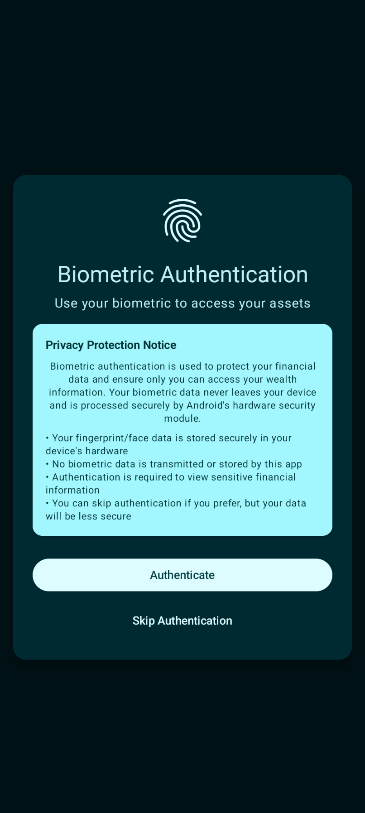

# Wealth Manager

以 Jetpack Compose 打造的現代化 Android 個人理財應用。資料僅存於本機、生物識別登入、即時市場數據（Finnhub、TWSE、ExchangeRate‑API）、多語系介面、120Hz 最佳化與豐富觸覺回饋。

語言：[English](README.md) | [繁體中文](README_zh.md)

## 主要功能

- 🔐 **生物識別安全**：指紋／臉部認證，24 小時會話逾時
- 💰 **投資組合管理**：現金與股票完整 CRUD
- 📊 **即時市場數據**：Finnhub（全球）、TWSE（台股）、ExchangeRate‑API（USD/TWD）
- 🔁 **韌性機制**：故障轉移、重試、請求去重、離線快取
- 🎨 **Material You**：動態色彩與響應式版面
- ⚙️ **效能**：120Hz 友善與效能監控
- 🌍 **在地化**：英文／繁中即時切換
- ⌚ **Wear OS**：資料層同步（獨立 Wear 模組）

## 📱 截圖

<div align="center">

### 投資組合概覽與資產管理
<table>
<tr>
<td width="50%">

<p align="center"><em>資產分佈與即時估值</em></p>
</td>
<td width="50%">

<p align="center"><em>直覺的現金與股票管理流程</em></p>
</td>
</tr>
</table>

### 生物識別與新增資產
<table>
<tr>
<td width="50%">

<p align="center"><em>安全登入與清楚隱私說明</em></p>
</td>
<td width="50%">

<p align="center"><em>智慧新增流程，支援股票搜尋與代碼查詢</em></p>
</td>
</tr>
</table>

### 關於與隱私
<table>
<tr>
<td width="50%">

<p align="center"><em>透明的隱私與第三方 API 資訊</em></p>
</td>
<td width="50%">
<!-- 空白欄位以保持版面均衡 -->
</td>
</tr>
</table>

</div>

## 安全與隱私

- **僅本機儲存**：財務資料不離開裝置（無雲端同步）
- **生物識別登入**：無需密碼，24 小時會話逾時
- **API 金鑰加密**：以 EncryptedSharedPreferences 儲存
- **日誌衛生**：金鑰遮罩；偵錯聚焦非敏感資訊

文件：[`Security Policy`](docs/security/SECURITY.md) · [`API 設定指南`](docs/api/API_SETUP.md)

## 快速開始

```bash
# 複製專案（或你的 fork）
git clone https://github.com/kuoyaoming/Wealth-Manager.git

# 建置（Debug）
./gradlew -PwmVersionName=0.0.0-beta.local -PwmVersionCode=1 assembleDebug

# 安裝到裝置
./gradlew installDebug
```

系統需求
- Android 14+（API 34+）
- 目標 SDK 35（Android 15）
- 建議具備生物辨識硬體
- 市場數據需網路連線

## API 金鑰

- 於 App 內設定：設定 → 管理 API 金鑰 → 驗證並儲存
- 金鑰以加密方式儲存在本機；請勿提交到版本控制
- 不使用 BuildConfig 金鑰；避免在 `local.properties` 放置真實金鑰
- 詳細步驟：[`docs/api/API_SETUP.md`](docs/api/API_SETUP.md)

## 架構概覽

- **模式**：MVVM + Repository
- **資料**：Room（本機儲存）、Retrofit/OkHttp
- **依賴注入**：Hilt
- **UI**：Jetpack Compose + Material 3
- **安全**：EncryptedSharedPreferences 金鑰；生物識別登入

```mermaid
graph TB
  subgraph "UI 層"
    U1[Compose UI 畫面<br/>（認證、儀表板、資產、設定）]
    U2[Navigation（NavHost）]
    U3[Material 3 ＋ 響應式版面]
    U4[觸覺與 120Hz 體驗]
  end

  subgraph "業務邏輯層"
    B1[ViewModels]
    B2[MarketDataService]
    B3[認證狀態：BiometricAuthManager / AuthStateManager]
    B4[FirstLaunchManager]
  end

  subgraph "資料層"
    D1[Repositories<br/>（AssetRepository、KeyRepository）]
    D2[Room 資料庫<br/>（WealthManagerDatabase＋DAOs）]
    D3[API Provider Service<br/>（Retrofit APIs）]
    D4[快取與韌性<br/>（CacheManager、TwseCacheManager）<br/>SmartCacheStrategy、重試、去重、<br/>錯誤處理、驗證、診斷]
  end

  U1 --> B1
  U2 --> B1
  U3 --> B1
  U4 --> B1

  B1 --> D1
  B2 --> D1
  B3 --> D1

  D1 --> D2
  D1 --> D3
  D1 --> D4
```



### 核心模組

```mermaid
graph LR
  subgraph "🔐 認證"
    A1[BiometricAuthManager]
    A2[AuthStateManager]
    A3[BiometricAuthScreen]
  end

  subgraph "💰 資產"
    B1[AssetsScreen]
    B2[AssetRepository]
    B3[Room DAOs]
  end

  subgraph "📊 市場數據"
    C1[MarketDataService]
    C2[ApiProviderService<br/>（FinnhubApi／TwseApi／ExchangeRateApi）]
    C3[快取與解析<br/>（TwseCacheManager／TwseDataParser）]
    C4[韌性<br/>（重試／去重／錯誤／驗證）]
  end

  subgraph "🎨 介面與系統"
    D1[DashboardScreen]
    D2[SettingsScreen]
    D3[Navigation]
    D4[Material 3／響應式]
    D5[PerformanceMonitor120Hz]
  end

  A1 --> A3
  A2 --> A3
  A3 --> D1
  D1 --> B1
  B1 --> C1
  C1 --> B2
  B2 --> B3
```



## 數據流程

```mermaid
graph TD
  UI[Compose UI] --> VM[ViewModel]
  VM --> RP[Repository]
  RP --> DB[Room]
  RP --> AP[ApiProviderService]

  AP --> F[Finnhub]
  AP --> T[TWSE]
  AP --> X[ExchangeRate]

  F --> C[快取]
  T --> C
  X --> C

  C --> MDS[MarketDataService]
  MDS --> AU[資產資料更新]
  AU --> DB

  AUTH[生物識別＋認證狀態（24h）] --> VM
  KEY[KeyRepository] --> AP
  RES[韌性<br/>（重試／去重／錯誤／驗證／診斷）] --> AP
  OFF[離線模式] --> C
  C --> LC[本地快取] --> UI
```



## 技術棧

- Kotlin、Jetpack Compose、Material 3
- Hilt、Room（本機儲存）、Retrofit、OkHttp（日誌）
- AndroidX Biometric
- Coroutines/Flows
- Wear OS 資料層

## Wear OS

- 獨立模組 `wear`（`minSdk 30`、`targetSdk 35`）
- 透過 `MobileWearSyncService` 與 Play Services Wearable 同步

## 貢獻

詳見 [`docs/development/CONTRIBUTING.md`](docs/development/CONTRIBUTING.md)

## 授權

MIT License — 見 [LICENSE](LICENSE)

---

版本：1.4.0  
最後更新：2025  
最低支援：Android 14（API 34）  
目標 SDK：35（Android 15）

## 發佈與版本

- versionName：來自 Git Tag `vX.Y.Z` → `X.Y.Z`（SemVer）
- versionCode：CI 的 `GITHUB_RUN_NUMBER`
- 釋出 AAB：僅於推送 Tag 時由 CI 產生

範例
```bash
# 建立並推送釋出標籤
git tag v1.4.0
git push origin v1.4.0

# 本地 Debug（Release 僅限 CI）
./gradlew -PwmVersionName=0.0.0-beta.local -PwmVersionCode=1 assembleDebug
```

產物
- Tag 觸發後，CI 會執行 `:app:bundleRelease` 並上傳 `.aab` 與 `mapping.txt`

## 開發狀態

### ✅ 已完成
- 生物識別登入，24 小時會話逾時
- 現金／股票資產管理（CRUD）
- 即時市場數據（Finnhub、TWSE、ExchangeRate‑API）
- 故障轉移、重試、請求去重
- Material 3 響應式 UI
- 英文／繁體中文在地化
- 效能監控與 120Hz 最佳化
- 智能快取與離線支援
- 錯誤復原與診斷

### 🚧 開發中
- 投資組合圖表
- 進階分析
- 數據匯出
- 強化圖表元件
