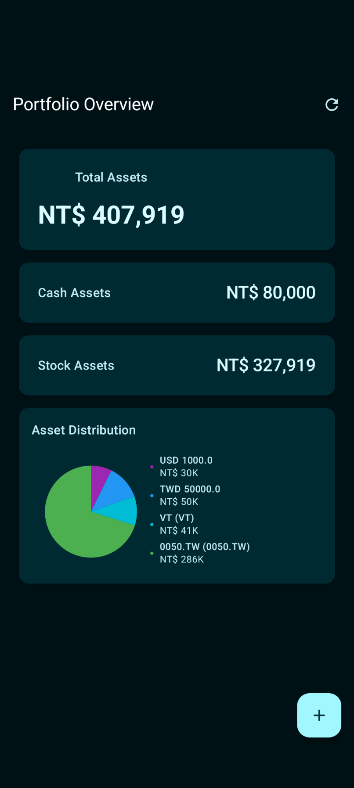

# Wealth Manager

一個使用 Jetpack Compose 建構的現代個人理財追蹤應用程式。具備生物識別安全、本地資產管理、即時市場數據、智能 API 切換和性能優化功能。

**語言**: [English](README.md) | [繁體中文](README_zh.md)

## 主要功能

- 🔐 **生物識別安全** - 指紋/臉部識別認證，24小時會話超時
- 💰 **投資組合追蹤** - 現金和股票投資管理，支援 CRUD 操作
- 📊 **即時市場數據** - 透過 Finnhub API、TWSE API 和匯率 API
- 🎨 **Material You** - 動態主題設計，響應式佈局
- 🌍 **多語言支援** - 英文和繁體中文，自動偵測
- 📱 **Android 16** - 最新 Android 功能，120Hz 性能優化
- ⚡ **性能監控** - 即時性能追蹤和優化
- 🗄️ **智能快取** - 智能快取管理，離線支援

## 📱 應用程式截圖

### 投資組合概覽

*完整的投資組合概覽，包含資產分佈圖表和即時估值*

### 資產管理

*直觀的現金和股票資產管理介面*

### 生物識別認證

*安全的生物識別認證，包含隱私保護說明*

### 新增資產

*智能資產新增功能，支援即時股票搜尋和代碼查詢*

### 關於與隱私

*透明的隱私政策和第三方 API 使用資訊*

## 安全特性

- **本地儲存** - 所有數據加密儲存在裝置上
- **生物識別認證** - 無需密碼，24小時會話超時
- **無雲端同步** - 完全隱私保護
- **會話管理** - 自動認證狀態管理

## 🔐 安全配置

### 快速設定

1. **執行設定腳本**:
   ```bash
   # Windows PowerShell (推薦)
   .\docs\setup\setup-dev.ps1
   
   # Windows Command Prompt
   .\docs\setup\setup-dev.bat
   
   # Linux/Mac
   ./docs/setup/setup-dev.sh
   ```

2. **遵循設定指南**: [API 設定指南](docs/api/API_SETUP.md)

### 安全功能

- ✅ **本地儲存** - 所有數據加密儲存在裝置上
- ✅ **程式碼中無 API 金鑰** - 金鑰安全儲存在 local.properties
- ✅ **生物識別認證** - 無需密碼
- ✅ **無雲端同步** - 完全隱私保護

### 文件

- 📖 [安全政策](docs/security/SECURITY.md) - 完整安全指南
- 🛠️ [API 設定指南](docs/api/API_SETUP.md) - 詳細 API 配置
- 👥 [貢獻指南](docs/development/CONTRIBUTING.md) - 開發指南

## 資產管理

- **現金追蹤** - 支援 TWD 和 USD
- **股票投資組合** - 台灣和美國市場
- **智能搜尋** - 即時股票代碼搜尋和匹配
- **資產編輯** - 完整的 CRUD 操作
- **即時價格更新** - 自動和手動刷新

## 市場數據

- **Finnhub API** - 主要數據源，支援美股和國際股票即時價格
- **TWSE API** - 台灣股票交易所數據整合，即時報價
- **匯率 API** - 即時 USD/TWD 匯率轉換
- **智能 API 切換** - 自動故障轉移確保數據可用性
- **請求去重** - 防止重複 API 呼叫，提升性能
- **快取支援** - 智能快取，離線數據可用性
- **錯誤恢復** - 自動重試機制和錯誤處理

## 技術架構

- **UI**: Jetpack Compose + Material 3
- **架構模式**: MVVM + Repository Pattern
- **依賴注入**: Hilt
- **資料庫**: Room (本地加密儲存)
- **網路**: Retrofit + OkHttp 含日誌記錄
- **認證**: Android Biometric API
- **程式語言**: Kotlin
- **目標平台**: Android 16 (API 36)
- **響應式設計**: 自適應佈局系統
- **性能**: 120Hz 優化與記憶體管理
- **快取**: 智能快取策略與 TWSE 數據解析器

## 安裝說明

```bash
# 複製專案
git clone https://github.com/yourusername/wealth-manager.git

# 建置專案
./gradlew assembleDebug

# 安裝到裝置
./gradlew installDebug
```

## 系統需求

- Android 16+ (API 36)
- 生物識別認證 (建議)
- 網路連線 (市場數據)
- 最少 100MB 儲存空間

## 應用程式架構


## 核心功能模組


### 🔐 認證系統
- **BiometricAuthManager** - 生物識別認證管理，含錯誤處理
- **AuthStateManager** - 會話狀態管理 (24小時超時)
- **BiometricAuthScreen** - 認證介面，含跳過選項

### 💰 資產管理
- **AssetsScreen** - 資產列表管理，含搜尋功能
- **AddAssetDialog** - 新增資產對話框，含股票搜尋
- **EditAssetDialog** - 編輯資產功能，支援現金和股票
- **CashAsset/StockAsset** - 現金/股票實體，支援多市場

### 📊 市場數據
- **MarketDataService** - 市場數據服務，含重試機制
- **ApiProviderService** - API 提供者服務，含故障轉移
- **FinnhubApi/TwseApi** - 多 API 整合，含快取
- **CacheManager** - 數據快取管理，智能策略
- **TwseDataParser** - 台灣股票數據解析和驗證

### 🎨 使用者介面
- **DashboardScreen** - 主儀表板，投資組合概覽
- **WealthManagerNavigation** - 導航系統，含認證流程
- **響應式佈局** - 自適應設計，支援不同螢幕尺寸
- **Material You** - 動態主題，性能優化
- **PerformanceMonitor120Hz** - 即時性能追蹤

## 數據流程架構


## 開發貢獻

1. Fork 專案
2. 建立功能分支 (`git checkout -b feature/amazing-feature`)
3. 提交變更 (`git commit -m 'Add amazing feature'`)
4. 推送到分支 (`git push origin feature/amazing-feature`)
5. 開啟 Pull Request

## 授權條款

MIT License - 詳見 [LICENSE](LICENSE) 檔案

---

**版本**: 1.0.0  
**最後更新**: 2025  
**Android 支援**: 16+ (API 36)  
**建置狀態**: 生產就緒

## 開發狀態

### ✅ 已完成功能
- 生物識別認證系統，24小時會話超時
- 資產管理 (現金/股票)，CRUD 操作
- 即時市場數據整合 (Finnhub、TWSE、匯率 APIs)
- 多 API 故障轉移，請求去重
- 響應式 UI 設計，Material 3 主題
- 多語言支援 (英文/繁體中文)
- 性能監控和 120Hz 優化
- 智能快取系統，離線支援
- 錯誤恢復和重試機制
- 除錯日誌和性能追蹤

### 🚧 開發中功能
- 投資組合視覺化圖表
- 進階分析功能
- 數據匯出功能
- 增強圖表組件
