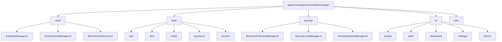
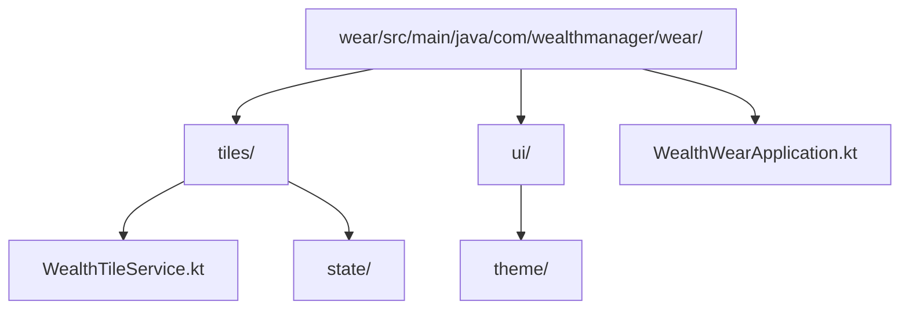
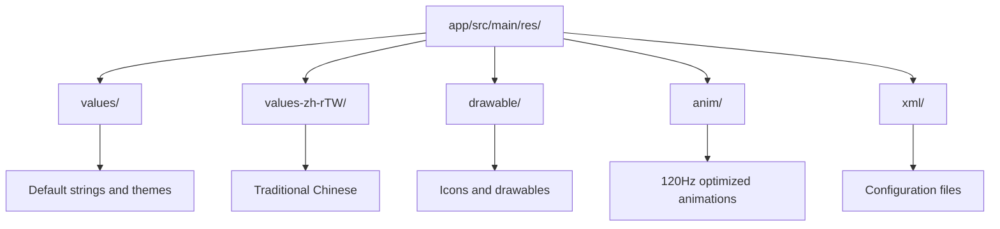
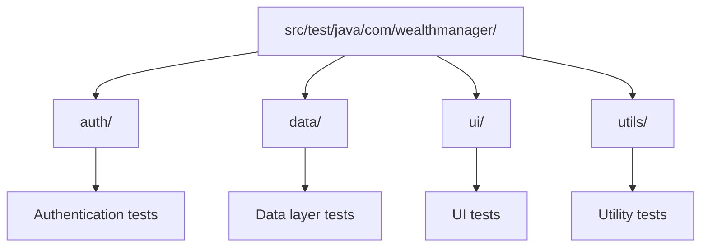

# Development Guide

This guide helps you set up the Wealth Manager development environment and understand the project structure.

## 📋 Table of Contents

- [Prerequisites](#prerequisites)
- [Development Setup](#development-setup)
- [Project Structure](#project-structure)
- [Build Configuration](#build-configuration)
- [Code Quality](#code-quality)
- [Testing](#testing)
- [Debugging](#debugging)
- [Troubleshooting](#troubleshooting)

## 🔧 Prerequisites

### **Required Software**

- **Android Studio**: Hedgehog (2023.1.1) or later
- **JDK**: 17 or later
- **Android SDK**: API 34+ (Android 14+)
- **Git**: Latest version
- **Kotlin**: 1.9.0+

### **System Requirements**

- **OS**: Windows 10+, macOS 10.15+, or Linux
- **RAM**: 8GB minimum, 16GB recommended
- **Storage**: 10GB free space
- **CPU**: Multi-core processor recommended

### **Android Studio Plugins**

Install these plugins in Android Studio:

- **Kotlin**: Built-in
- **Android Gradle Plugin**: Built-in
- **Git Integration**: Built-in
- **Code Quality**: Detekt, ktlint

## 🚀 Development Setup

### **1. Clone Repository**

```bash
# Clone the repository
git clone https://github.com/kuoyaoming/Wealth-Manager.git
cd Wealth-Manager

# Verify you're on the main branch
git checkout main
```

### **2. Environment Configuration**

```bash
# Copy environment template
cp local.properties.template local.properties

# Edit local.properties with your configuration
# Add your Android SDK path and API keys
```

**Example `local.properties`:**
```properties
# Android SDK
sdk.dir=/path/to/android/sdk

# API Keys (for development)
FINNHUB_API_KEY=your_finnhub_key_here
TWSE_API_KEY=your_twse_key_here
EXCHANGE_RATE_API_KEY=your_exchange_rate_key_here
```

### **3. API Keys Setup**

See [API Setup Guide](API_SETUP.md) for detailed instructions on obtaining API keys.

### **4. Build Project**

```bash
# Clean and build
./gradlew clean
./gradlew assembleDebug

# Run tests
./gradlew test

# Check code quality
./gradlew codeQualityCheck
```

### **5. Run on Device**

```bash
# Install debug version
./gradlew installDebug

# Or use Android Studio
# Run → Run 'app'
```

## 🏗️ Project Structure

### **Main Application (`app/`)**



### **Wear OS Module (`wear/`)**



### **Resources**



## ⚙️ Build Configuration

### **Gradle Files**

- **`build.gradle`**: Root build configuration
- **`app/build.gradle`**: Main app configuration
- **`wear/build.gradle`**: Wear OS configuration
- **`settings.gradle`**: Project settings

### **Key Dependencies**

```kotlin
// Core Android
implementation 'androidx.core:core-ktx:1.12.0'
implementation 'androidx.lifecycle:lifecycle-runtime-ktx:2.7.0'

// Compose
implementation 'androidx.activity:activity-compose:1.8.2'
implementation 'androidx.compose.ui:ui:1.5.4'
implementation 'androidx.compose.material3:material3:1.1.2'

// Architecture
implementation 'androidx.hilt:hilt-android:2.48'
implementation 'androidx.room:room-ktx:2.6.1'

// Networking
implementation 'com.squareup.retrofit2:retrofit:2.9.0'
implementation 'com.squareup.okhttp3:okhttp:4.12.0'
```

### **Build Variants**

- **Debug**: Development build with logging
- **Release**: Production build with optimizations

### **Signing Configuration**

```kotlin
android {
    signingConfigs {
        release {
            storeFile file('keystore.jks')
            storePassword System.getenv('ANDROID_KEYSTORE_PASSWORD')
            keyAlias System.getenv('ANDROID_KEY_ALIAS')
            keyPassword System.getenv('ANDROID_KEY_PASSWORD')
        }
    }
}
```

## 🔍 Code Quality

### **Static Analysis Tools**

#### **Detekt**
```bash
# Run detekt
./gradlew detekt

# Generate baseline
./gradlew detektBaseline

# Check against baseline
./gradlew detektBaseline
```

#### **ktlint**
```bash
# Check formatting
./gradlew ktlintCheck

# Auto-format
./gradlew ktlintFormat
```

### **Code Quality Rules**

- **Line Length**: Maximum 120 characters
- **Naming**: Follow Kotlin conventions
- **Documentation**: KDoc for public APIs
- **Testing**: Unit tests for business logic

### **Code Style Configuration**

```yaml
# detekt.yml
complexity:
  maxComplexity: 15
  maxLineLength: 120

style:
  MaxLineLength:
    maxLineLength: 120
```

## 🧪 Testing

### **Test Structure**



### **Running Tests**

```bash
# Run all tests
./gradlew test

# Run specific test class
./gradlew test --tests "BiometricAuthManagerTest"

# Run with coverage
./gradlew testDebugUnitTestCoverage
```

### **Test Examples**

```kotlin
@Test
fun `authenticateUser should return success when biometric is available`() {
    // Given
    val mockBiometricManager = mockk<BiometricManager>()
    every { mockBiometricManager.isAvailable() } returns true
    
    // When
    val result = authManager.authenticateUser()
    
    // Then
    assertThat(result).isEqualTo(AuthResult.Success)
}
```

## 🐛 Debugging

### **Debug Configuration**

1. **Set Breakpoints**: In Android Studio
2. **Debug Mode**: Run → Debug 'app'
3. **Logcat**: View logs in Android Studio
4. **Device Logs**: Use `adb logcat`

### **Common Debug Commands**

```bash
# View logs
adb logcat | grep WealthManager

# Clear logs
adb logcat -c

# Install debug APK
adb install -r app/build/outputs/apk/debug/app-debug.apk

# Uninstall app
adb uninstall com.wealthmanager
```

### **Debug Logging**

```kotlin
// Use StandardLogger for consistent logging
private val logger = StandardLogger("ComponentName")

logger.log("DEBUG", "Debug message")
logger.logError("ERROR", "Error message", exception)
```

## 🔧 Troubleshooting

### **Common Issues**

#### **Build Failures**

```bash
# Clean and rebuild
./gradlew clean
./gradlew assembleDebug

# Invalidate caches in Android Studio
# File → Invalidate Caches and Restart
```

#### **API Key Issues**

```bash
# Check if API keys are set
./gradlew :app:assembleDebug --info | grep API_KEY

# Verify local.properties
cat local.properties
```

#### **Dependency Issues**

```bash
# Update dependencies
./gradlew dependencies --write-locks

# Clean Gradle cache
./gradlew clean
rm -rf ~/.gradle/caches
```

#### **Device Connection Issues**

```bash
# Check device connection
adb devices

# Restart ADB
adb kill-server
adb start-server
```

### **Performance Issues**

#### **Slow Builds**

```bash
# Enable Gradle daemon
echo "org.gradle.daemon=true" >> gradle.properties

# Increase heap size
echo "org.gradle.jvmargs=-Xmx4g" >> gradle.properties
```

#### **Memory Issues**

```bash
# Increase Android Studio memory
# Help → Edit Custom VM Options
-Xmx4g
```

### **Wear OS Development**

#### **Wear OS Setup**

```bash
# Install Wear OS app
./gradlew :wear:installDebug

# Debug Wear OS
adb -s <wear_device_id> shell
```

#### **Data Layer Sync**

```bash
# Check data layer sync
adb shell dumpsys activity service com.google.android.gms.wearable
```

## 📚 Additional Resources

### **Documentation**

- [Android Development](https://developer.android.com/)
- [Jetpack Compose](https://developer.android.com/jetpack/compose)
- [Room Database](https://developer.android.com/training/data-storage/room)
- [Hilt Dependency Injection](https://developer.android.com/training/dependency-injection/hilt-android)

### **Tools**

- [Android Studio](https://developer.android.com/studio)
- [ADB Commands](https://developer.android.com/studio/command-line/adb)
- [Gradle Build Tool](https://gradle.org/)

### **Community**

- [Android Developers](https://developer.android.com/community)
- [Kotlin Community](https://kotlinlang.org/community/)
- [Jetpack Compose Community](https://developer.android.com/jetpack/compose/community)

## 🆘 Getting Help

### **Common Questions**

1. **Q: Build fails with "SDK location not found"**
   - A: Set `sdk.dir` in `local.properties`

2. **Q: API calls fail with authentication error**
   - A: Check API keys in `local.properties`

3. **Q: Wear OS app doesn't sync**
   - A: Ensure both apps are installed and data layer is enabled

### **Support Channels**

- **GitHub Issues**: [Report Issues](https://github.com/kuoyaoming/Wealth-Manager/issues)
- **GitHub Discussions**: [Ask Questions](https://github.com/kuoyaoming/Wealth-Manager/discussions)
- **Documentation**: [Read Docs](docs/)

---

**Happy Coding!** 🚀

*For more information, see the [Contributing Guide](CONTRIBUTING.md) and [API Setup Guide](API_SETUP.md).*
