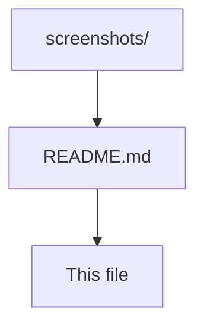

# Screenshots

This directory contains application screenshots for documentation and marketing purposes.

## 📱 Screenshot Guidelines

### File Naming Convention
- Use descriptive names: `feature-name.png`
- Use lowercase with hyphens: `portfolio-overview.png`
- Include resolution if needed: `biometric-auth-hd.png`

### Recommended Screenshots

1. **portfolio-overview.png** - Main dashboard showing total assets and distribution
2. **asset-management.png** - Asset management screen with cash and stock listings
3. **biometric-auth.png** - Biometric authentication screen with privacy notice
4. **add-assets.png** - Add asset dialog with stock search functionality
5. **about-app.png** - About screen showing privacy policy and API usage

### Image Requirements
- **Format**: PNG (preferred) or JPG
- **Resolution**: Minimum 1080x1920 (Full HD)
- **Aspect Ratio**: 9:16 (mobile portrait)
- **File Size**: Under 2MB per image
- **Quality**: High resolution, clear text

### Usage in Documentation
Screenshots are referenced in:
- Main README.md
- README_zh.md (Chinese version)
- GitHub repository display
- Project documentation

## 📸 Capturing Screenshots

### Android Studio
1. Open Android Studio
2. Run app on device/emulator
3. Use Device File Explorer to capture screenshots
4. Save with descriptive names

### Physical Device
1. Enable Developer Options
2. Use "Take Screenshot" in Developer Options
3. Transfer to computer
4. Rename and organize

### Emulator
1. Run app in Android Emulator
2. Use emulator's screenshot tool
3. Save to project directory
4. Optimize for documentation

## 🎨 Screenshot Optimization

### Before Uploading
- Crop to remove status bar if needed
- Ensure text is readable
- Check for sensitive data (remove if present)
- Optimize file size

### Privacy Considerations
- Remove or blur any personal financial data
- Use demo data for screenshots
- Ensure no real API keys are visible
- Check for personal information

## 📁 File Organization

### **Current Files**
- **`README.md`** - This documentation file

### **Video Demo**
- **YouTube Shorts**: [Wealth Manager App Demo](https://youtube.com/shorts/kW68GsKsGJ0?feature=share)
- **GitHub Compatible**: Using YouTube thumbnail with click-to-play link
- **Note**: GitHub doesn't support iframe embeds, so we use thumbnail images that link to YouTube
